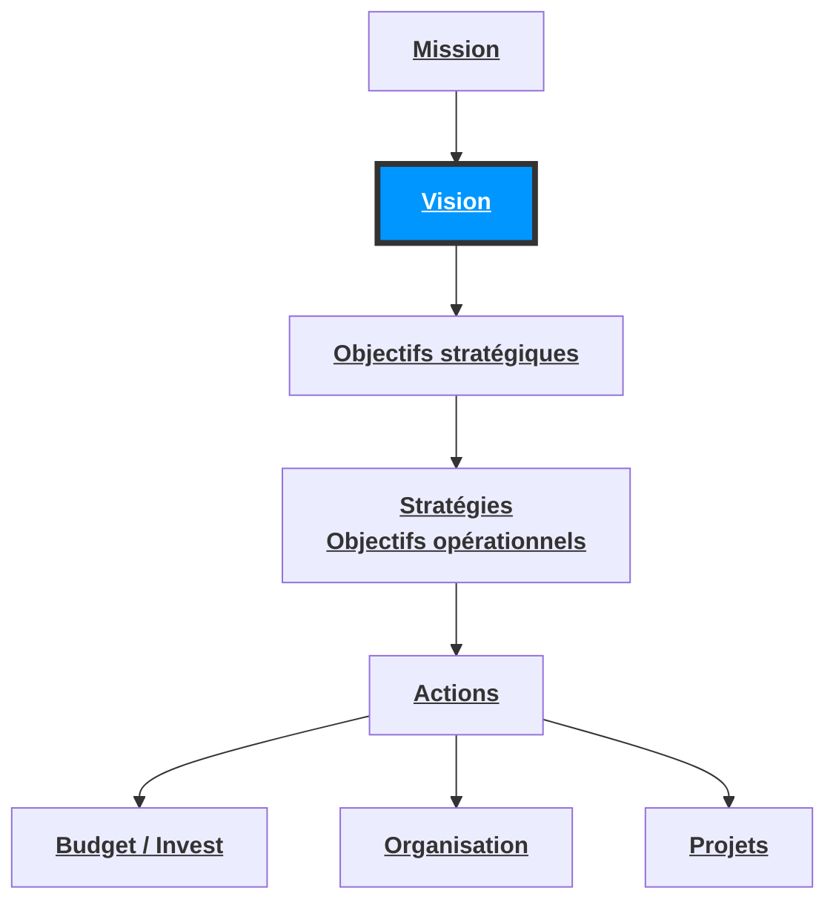
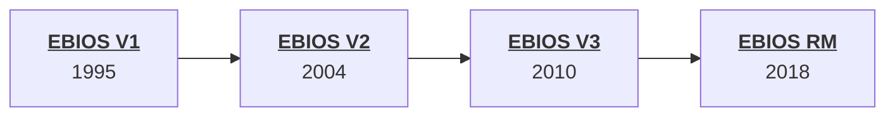

# 1. Entreprise : Une stratégie
## La raison d'être de l'organisation
- Définir la **mission** de l'entreprise : c'est-a-dire sa raison d'être, sa finalité.
- Identifier la **vision** de l'entreprise : c'est-a-dire son ambition, sa cible à plus ou moins Long terme.

Ces deux étapes constituent les bases sur lesquelles seront élaborées les objectifs stratégiques, puis les stratégies mises en œuvre.

Illustration de missions d'entreprise
- Google : organiser l'information a l'échelle mondiale et la rendre universellement accessible et utile
Illustration de visions d'entreprise
APPLE : Apporter la meilleure expérience d'utilisateur à ses clients au travers du hardware, software et des services

## Objectifs stratégiques 
La méthode S.M.A.R.T permet d'identifier des objectifs stratégiques

![[FORMATION EXPERT SECURITE DIGITALE (ESD)/COURS/9-Gestion des risques SI avec ISO 27005 ET EBIOS 2010/img/Capture d’écran 2023-05-02 à 16.53.09.png]]

Pour chaque objectif défini, 1 à 6 stratégies sont à identifier. Chaque stratégie représente le « COMMENT »
Ces stratégies s'appellent aussi les objectifs opérationnel
### Exemples de stratégie : 
Objectif : Disposer d'un catalogue d'au moins 10 formations sur les 3 prochaines années

## Stratégies de développement
La méthodologie S.W.O.T peut permettre d'identifier une stratégie de développement cohérente 

![[FORMATION EXPERT SECURITE DIGITALE (ESD)/COURS/9-Gestion des risques SI avec ISO 27005 ET EBIOS 2010/img/Capture d’écran 2023-05-03 à 21.24.23.png]]

# 2. Gouvernance et alignement
## Stratégie d'entreprise et schéma directeur 
Le schéma directeur SI / SSI traditionnel prend justement comme point de départ les projets d’entreprise à réaliser.
Il convient donc d'effectuer une extraction des projets ayant une connotation SI / SSI afin de compiler les projets associés à la stratégie de l'organisation.

## Gouvernance et alignement 
Le fonctionnement souhaité: 
SDE (Schéma directeur d'entreprise) et SD SI/SSI sont développés conjointement.

# 3. La gestion des risques SI
## Les avantages de la gestion des risques 

![[FORMATION EXPERT SECURITE DIGITALE (ESD)/COURS/9-Gestion des risques SI avec ISO 27005 ET EBIOS 2010/img/Capture d’écran 2023-05-03 à 21.38.34.png]]
La gestion des risques permet d’investir la sécurité la ou elle sera réellement nécessaire
L'analyse de risques est l'ensemble des processus et procédures consistant a calculer la criticité (pertinence et gravité) et la vraisemblance de survenance de dangers pour une organisation.
**Risque = Gravité x Vraisemblance**

## Une norme 
- La norme la plus récente en matière de **gestion des risques** en **sécurité de l'information** est l'**ISO 27005**
- Plusieurs méthodes d'analyse de risques se basent sur les exigences de cette même norme (MEHARI, EBIOS etc…)

![[ESD/Documents/Images/Pasted image 20230612140426.png]]

**ISO 31000** désigne une famille de normes de gestion des risques

## Les actifs / biens 
Un actif est tout ce qui a de La valeur pour l'organisme et qui a donc besoin d'une protection.
La norme ISO 27005 utilise La terminologie : ACTIF
La méthode EBIOS 2010 utilise la terminologie : BIEN

## Niveau de profondeur (Zoom)

### Macro Vs Détails 
Il est conseillé de trier / Regrouper / Décomposer les biens en fonction des objectifs de l’étude et de ses besoins de sécurité

### Méthodes 
Dans le cas où l'entreprise n'a jamais effectué d'appréciation des risques, le premier travail consiste donc à choisir une méthode.

## Evaluation des risques 
Ce processus consiste à analyser et pondérer chaque risque identifié selon les menaces, les vulnérabilités et les impacts associés 
**Risque = Gravité * Vraisemblance** 
Selon ISO 27005: 
- Un risque est l'effet de l'incertitude sur l'atteinte des objectifs

| Type de menace |  Exemple|
| ---|--- |
| 1. Dommage physique | Feu / Dégât d’eau |
| 2. Désastre naturel | Tremblement de terre / Inondation |
| 3. Perte de service essentiel | Panne de climatisation / Panne électrique |
| 4. Perturbation causée par radiation | Radiation|
| 5. Information compromise | Écoute électronique / Vol de documents |
| 6. Panne technique | Bris d’équipement / Saturation de réseau |
| 7. Action non autorisée | Accès non autorisé / Logiciel pirate |

## Vulnérabilités 
Faille d'un actif ou d'une mesure de sécurité qui pourrait être exploitée par une menace
### Lien actif, vulnérabilité et menace 

| Actif | Vulnérabilité |  Menace |
| --- | --- | ---|
| 1. Matériel informatique | Entrepôt non surveillé / Sensibilité à l'humidité  | Vol d'équipement / Corrosion |
| 2. Logiciel | Absence d'audit / Interface compliquée  | Abus de droits non détecté / Erreur de saisie  |
| 3. Réseau | Communication non protégée/ Mot de passe en clair | Écoute électronique / Hacker |
| 4. Personnel | Formation insuffisante / Manque de supervision | Erreur / Vol d'équipement, erreurs |
| 5. Localisation | Endroit inondable / Réseau électrique instable | Inondation / Perte de courant |
| 6. Structure organisationnelle | Absence de processus d'autorisation de droits d'accès / Absence de processus de gestion documentaire | Abus de privilèges / Corruption de données |

#### Traitement des risques 
##### Evaluation des options de traitement 
- Modifier le risque: Mesures de sécurité sélectionnées pour diminuer le risque
- Maintenir le risque: La direction décide d’assumer le risque
- Partager le risque: Partager avec des parties externes : assurances ou infogérances
- Éviter le risque:  Annulation ou modification d’une activité liée au risque 

#### Le plan de traitement des risques 
Une fois que les décisions de traitement des risques ont été prises, les activités pour mettre en œuvre ces décisions doivent être identifiées et planifiées 

### Les risques résiduels 
Risque Net = Risque Brut — Efficacité des mesures existantes
Risque résiduels = Risque Net — Efficacité des mesures (traitement)

# 4. Présentation de la norme ISO 27005
## La norme 
-  L'ISO 27005:2018 : lignes directrices relatives à la gestion des risques en sécurité de l'information.
- Les normes ISO sont ré-examinées tous les cinq ans (généralement)

## Certification ? 
La norme ISO 27005 ne décrit qu'une démarche, elle ne permet pas la certification d'un système, contrairement à la norme ISO 27001. 

## La nouvelle ISO 27005 

EBIOS RM | ISO 27005 (CD2)
----|---
Source de risque/Objectifs visés (SR/OV)| Risk source and desired end state 
Ecosystéme | Ecosystem 
Niveau de menace des parties prenantes | Danger level of interested parties
Scénarios stratégiques | event based approach / strategic scenarios 
Scénarios opérationnels | asset based approach / operational scenarios
Cycles stratégiques/opérationnels |  Risk management cycles

# 5. La méthode EBIOS
## Présentation de la méthode 
EBIOS signifie : Expression des besoins et identification des objectifs de sécurité. 
Méthode créée et supportée par l'ANSSI 

## Module 1 - Etude du contexte 
Ce module a pour objectif de collecter les éléments nécessaires à la gestion des risques, qu'elle soit adaptée à la réalité du contexte d'étude et que ses résultats soient pertinents et utilisables par les parties prenantes. Définition des périmètres en fonction des objectifs.

### M1 - Cadrer l'étude des risques 
Identifier les éléments pouvant impacter la sécurité de l'information. Déterminer les objectifs de l‘analyse de risques pour l'organisme et identifier les livrables de sortie.
- les actions à entreprendre (
- les ressources à prévoir et le rôle des parties prenantes
- le calendrier prévisionnel
- les documents à produire 

| Rôle                      | Responsabilité                                                                                                              |
| ------------------------- | --------------------------------------------------------------------------------------------------------------------------- |
| Direction                 | Approuve le risque                                                                                                          |
| Finances                  | Participe à l'analyse coûts/bénéfices                                                                                       |
| RH                        | Identifient les formations requises pour le personnel, ainsi que la sensibilisation                                         |
| Sécurité de l'information | Identifie et propose les mesures appropriées pour gérer le risque                                                           |
| Service informatique      | Met en place les solutions de mesures technique et les gère dans les opérations informatique quotidiennes                   |
| Service juridique         | Identifie les exigences en matière de conformité et les analyse                                                             |
| Relations publiques       | Valident les impacts sur la réputation de l'organisme et s'occupent des communications avec les parties prenantes externes. |

##### Rôle / Responsabilités 

Il est nécessaire de mettre en œuvre une démarche de gestion de projet de type RACI.
RACI est l'acronyme de **Responsible (réalisateur), Accountable (approbateur), Consulted (consulté), Informed (informé)**. C'est un outil d'affectation des rôles et responsabilités aux différentes parties prenantes d'un projet.

![[FORMATION EXPERT SECURITE DIGITALE (ESD)/COURS/9-Gestion des risques SI avec ISO 27005 ET EBIOS 2010/img/Capture d’écran 2023-05-03 à 22.21.34.png]]

### M1 - Description du contexte générale 
Consiste a se familiariser avec l'environnement de l'étude, de manière à identifier les éléments pouvant impacter la manière de gérer les risques de sécurité de l'information. 

### M1 - Délimiter le périmètre de l'étude 
Consiste à circonscrire le périmètre d'étude au sein du contexte général, a expliquer ce qu'est le périmètre de l'étude et ce à quoi il sert. Les participants à l'étude sont également définis. 

### M1 - Identifier les paramètres à prendre en compte 
Consiste à recenser les éléments qui devraient avoir une incidence sur la gestion des risques (sur l'appréciation et/ou le traitement) :
Consiste à déterminer les sources de menaces pertinentes vis-à-vis du périmètre de l'étude.

Les parties prenantes doivent réfléchir aux origines des risques : qui ou quoi pourrait porter atteinte aux besoins de sécurité exprimés et engendrer les impacts identifiés ?

### M1 - Identification des sources de menaces 
Les sources de menaces doivent être caractérisées pour une appréciation des risques pertinente. L'exposition à ces menaces, leur potentiel, motivation, facilité d'accès, capacité, temps, compétences, et ressources devraient être évalués pour adapter les mesures de sécurité. Une analyse approfondie garantit des contre-mesures appropriées.

### M1 - Définition des critères de sécurité
Dans cette étape, les critères de sécurité sont sélectionnés et définis. Des échelles de besoins sont créées pour chaque critère retenu. Trois critères incontournables sont la disponibilité, l'intégrité et la confidentialité, reflétant les besoins essentiels des biens.

### M1 - Critère Traçabilité ? 
Utilité du critère de traçabilité : deux approches possibles. Soit intégrer les "traces" comme bien essentiel (intégrité et disponibilité). Soit considérer la traçabilité comme une mesure de sécurité pour dissuasion et récupération des événements redoutés.

### La méthode EBIOS 

Critères de sécurité | Définitions 
---|---
Disponibilité | Propriété d'accessibilité au moment voulu des biens essentiels. 
Intégrité | Exactitude et de complétude des biens essentiels. 
Confidentialité | Propriété des biens essentiels de n'être accessibles qu'aux utilisateurs autorisés. 
### M1 - Elaboration d'une échelle de gravité 
Créer une échelle des niveaux d'impacts est une action importante pour évaluer les conséquences des risques. Cette échelle, généralement ordinale, classe les objets par ordre de grandeur et permet d'estimer la gravité des conséquences cumulées d'un sinistre.

### M1 - Elaboration d'une échelle de vraisemblance 
Cette action consiste à créer une échelle décrivant tous les niveaux possibles de vraisemblance des scénarios de menaces.

### M1 - Définir les critères de gestion des risques 
La formalisation des critères de gestion de risques permet de guider les décisions tout au long de l'étude. Elle définit comment estiment et évaluent les événements redoutés, les scénarios de menaces, les risques, et leur traitement et validation.

### M1 - Identification des biens essentiels 
Cette action recense les éléments du patrimoine informationnel essentiels au périmètre de l'étude. Il inclut des informations vitales pour l'organisation, les traitements secrets, les données personnelles et stratégiques. Chaque élément doit être associé à un responsable pour exprimer les besoins de sécurité.

### M1 - Identification des biens supports 
Étudier les biens supports du système d'information, qu'ils soient techniques ou non techniques, et comprendre leurs relations pour évaluer leur vulnérabilité face aux menaces et leur impact sur les biens essentiels. Analyser la propagation des incidents éventuels.

### M1 - Interconnexions entre biens essentiels et supports 
Cette action établit le lien entre les biens essentiels et les biens supports, révélant leur criticité et les risques réels. On identifie les biens supports qui stockent ou traitent les biens essentiels à différentes étapes de leur cycle de vie.

### M1 - Etude des mesures de sécurité existantes 
Cette action recense les mesures de sécurité existantes ou prévues pour les biens supports. Pour chaque bien, on vérifie l'existence de mesures techniques ou non techniques (logicielles, physiques, organisationnelles) afin de protéger ces biens.

## Module 2 - Etude des évènements redoutés
Ce module a pour objectif d'identifier de manière systématique les scénarios génériques que l'on souhaite éviter concernant le périmètre de l'étude : les événements redoutés.

### M2 - Analyser tous les évènements redoutés
Cette action vise à définir les besoins de sécurité, les impacts du non-respect de ces besoins, et les sources de menaces potentielles pour chaque critère de sécurité des biens essentiels. Les événements redoutés sont hiérarchisés selon les critères de gestion des risques choisis.

## Module 3 - Etude des scénarios de menaces
Ce module vise à identifier les scénarios de menaces qui pourraient compromettre la sécurité des informations du périmètre étudié. On sélectionne les sources de menaces, vulnérabilités et vraisemblance associées. Les scénarios sont hiérarchisés selon les critères de gestion des risques choisis.

## Module 4 - Étude des risques
Ce module vise à identifier les risques pesant sur le périmètre étudié et à choisir les actions de traitement appropriées en tenant compte du contexte. Les réflexions sont d'ordre fonctionnel plutôt que technique.

### M4 - Analyser les risques
Cette action consiste à identifier les risques pesant sur le périmètre de l'étude et à évaluer leur gravité et leur vraisemblance. On détermine d'abord le risque brut en ignorant les mesures de sécurité existantes, puis le risque net en les prenant en compte.

### M4 - Application des mesures existantes dans le calcul du risque 
Pour chaque risque, il faut sélectionner les mesures de sécurité appropriées pour protéger les besoins de sécurité des biens essentiels, réduire les impacts identifiés, contrer les sources de menaces, se protéger contre les menaces, et réduire les vulnérabilités des biens supports.

### M4 - Evaluation des risques 
Cette action hiérarchise les risques en fonction des critères de gestion retenus. Certains risques peuvent être écartés si leur gravité ou vraisemblance est faible. Il est crucial de justifier ces exclusions car ils seront considérés comme des risques non traités dans l'étude.

### M4 - Choisir les options de traitement des risques 
Cette action consiste à choisir comment traiter les risques pour atteindre un niveau de risque résiduel acceptable. Les options comprennent l'évitement, la réduction, l'acceptation du risque, voire le transfert avec le partage des pertes et responsabilités avec des tiers.

### M4 - Analyse des risques résiduels 
Cette action vise à identifier et évaluer les risques résiduels après la mise en place des mesures de traitement. On doit s'assurer que ces risques restants sont acceptables selon les critères de gestion des risques établis, en estimant leur gravité et leur vraisemblance.

## Module 5 - Etude des mesures de sécurité 
Ce module vise à traiter les risques et suivre leur mise en œuvre en cohérence avec le contexte de l'étude. Les réflexions sont menées conjointement entre les niveaux fonctionnels et techniques.

### M5 - Déterminer les mesures de sécurité 
Les mesures peuvent être adaptées de référentiels existants ou créées spécifiquement. Les mesures doivent être cohérentes avec l'objectif de l'étude et peuvent inclure des exigences, règles, procédures, ou choix de produits. Chaque mesure est associée à une ligne de défense (préventive, protectrice ou récupératrice) et à un bien support.

Pour assurer une défense en profondeur, il est essentiel de mettre en place trois lignes de défense :
1. **Ligne préventive** : Évite les incidents en agissant sur les sources de menaces
2. **Ligne protectrice** : Bloque, contient et détecte les incidents 
3. **Ligne récupératrice** : Minimise les conséquences des incidents et rétablit l'état initial 

Chaque ligne de défense peut être renforcée avec des mesures de sécurité sur différents biens supports. Des mesures de soutien complémentaires devraient également être mises en place pour assurer une protection globale.
Cette action consiste à identifier et à estimer les risques résiduels qui subsisteront quand chaque mesure de sécurité sera mise en œuvre. 

### M5 - Etablir une déclaration d'applicabilité 
Cette action explique comment les paramètres ont été pris en compte dans l'étude, rappelant leur importance pour l'appréciation des risques et les mesures de sécurité. Les justifications sont fournies si certains paramètres n'ont pas été considérés. Garantit une approche complète et cohérente de l'étude de sécurité.

### M5 - Plan d'action (mise en œuvre des mesures de sécurité)
Cette action consiste à identifier parmi les mesures de sécurité formalisées celles qui ne seraient pas déjà appliquées et à planifier concrètement les actions nécessaires à leur mise en œuvre. 

### M5 - Prononcer l'homologation de sécurité 
Cette action consiste à obtenir une validation formelle de l'étude. L'homologation est l'engagement attestant que le projet a pris en compte les contraintes opérationnelles, protégé le système et les informations selon les objectifs de sécurité, avec des risques résiduels acceptés et maîtrisés. L'autorité peut donner une homologation provisoire, un refus ou une homologation (fréquemment entre 3 et 5 ans) complète avec conditions.

### M5 - Suivi et examen des facteurs de risque 
### M5 - Surveillance, réexamen et amélioration de la gestion du risque 

# EBIOS RM
#### Termes et définitions

##### Action élémentaire (Elementary action)  
Action unitaire exécutée par une source de risque sur un bien support dans le cadre d’un scénario opérationnel. 

##### Appréciation des risques (Risk assessment)  
Ensemble du processus d’identification, d’analyse et d’évaluation des risques (ISO 31000:2018). Dans la démarche EBIOS RM, cela correspond aux ateliers 2 (sources de risque), 3 (scénarios stratégiques) et 4 (scénarios opérationnels).

##### Besoin de sécurité (Security need)  
Propriété de sécurité à garantir pour une valeur métier. Elle traduit un enjeu de sécurité cette valeur.

##### Bien support (Supporting asset)  
Composante du système d’information sur laquelle repose une ou plusieurs valeurs métier. Un bien support peut être de nature numérique, physique ou organisationnelle. 

##### Bien support critique (Critical supporting asset)  
Bien support jugé très susceptible d’être ciblé par une source de risque pour atteindre son objectif. Les biens supports critiques sont ceux qui apparaissent dans les scénarios opérationnels.

##### Cartographie de menace numérique de l'écosystème (Ecosystem digital threat mapping)  
Représentation visuelle du niveau de menace des parties prenantes de l’écosystème vis-à-vis de l’objet étudié.

##### Cartographie du risque (Risk mapping)  
Représentation visuelle des risques issus des activités d’appréciation du risque.

##### Chemin d'attaque (Attack path)  
Suite d’événements distincts que la source de risque devra probablement générer pour atteindre son objectif. Cette terminologie concerne les scénarios stratégiques.

##### Correctif de sécurité (Security patch)  
Section de code ajoutée à un logiciel dans le but de corriger une vulnérabilité identifiée.

##### Déni de service (Denial of service)  
Attaque rendant indisponible des services en exploitant des vulnérabilités.

##### Ecosystème (Ecosystem)  
Ensemble des parties prenantes en interaction avec l'objet de l'étude.

##### Evènement intermédiaire (Intermediate event)  
Un événement intermédiaire intervient dans la séquence d'un scénario stratégique. Il peut être généré par la source de risque envers une partie prenante de l'écosystème pour faciliter l'atteinte de son objectif.

##### Evènement redouté (Feared event)  
Les événements redoutés sont ceux des scénarios stratégiques et se rapportent à l’impact d’une attaque sur une valeur métier. Ils sont liés à une valeur métier qui affecte un critère de sécurité, évalué selon la gravité des conséquences. 
  
##### Gravité (Severity)  
Niveau et intensité des effets préjudiciables d'un risque, évalué par des échelles (négligeable, mineure, majeure, critique, maximale).

##### Homologation de sécurité (Security accreditation)  
Validation par une autorité d'homologation que le niveau de sécurité atteint par l'organisation est conforme aux attentes et que les risques résiduels sont acceptés dans l'étude.

##### Ingénierie sociale (Social engineering)  
Acquisition déloyale d'informations en exploitant les failles humaines et sociales de la structure ciblée, utilisée pour obtenir un bien, un service ou des informations clés.

##### Menace (Threat)  
Désigne une intention de nuire dans le cyber espace. Une menace peut être ciblée ou non sur l’objet de l’étude.

##### Mesure de sécurité (Security control)  
Moyen de traiter un risque, pouvant être fonctionnel, technique ou organisationnel, agissant sur des valeurs métier, biens supports ou parties prenantes de l'écosystème. Certaines mesures peuvent se renforcer mutuellement en agissant selon des axes complémentaires.

##### Mission  
Fonction, finalité, raison d’être de l’objet de l’étude.  

##### Mode opératoire (Operating mode)  
Suite d’actions élémentaires que la source de risque devra réaliser pour atteindre son objectif. Cette terminologie concerne les scénarios opérationnels.

##### Niveau de menace d'une partie prenante vis à vis de l'objet d'étude (Threat level of a stakeholder)  
Mesure du potentiel de risque d'une partie prenante de l’écosystème sur l’objet de l’étude, compte tenu de son interaction avec lui, sa vulnérabilité, son exposition au risque et de sa fiabilité.

##### Niveau de risque (Risk level)  
Mesure de l’importance du risque, exprimée par la combinaison de la gravité et de la vraisemblance.  

##### Objectif visé (OV) (Target objective)  
Finalité visée par une source de risque, selon ses motivations. 

##### Objet de l'étude / Objet étudié (Studied object)  
Organisation, système d’information ou produit faisant l’objet de l’appréciation des risques.  

##### Partie prenante (Stakeholder)  
Élément interne ou externe en interaction directe ou indirecte avec l'objet de l'étude, comme des partenaires, prestataires, clients, fournisseurs, filiales ou services de support connexes.

##### Partie prenante critique (PPC) (Critical stakeholder)  
Élément de l'écosystème susceptible d'être un vecteur d'attaque privilégié en raison de son accès privilégié, de sa vulnérabilité ou de son exposition au risque.

##### Plan d'amélioration continue de la sécurité (PACS) (Security continuous improvement plan)  
Document regroupant les mesures de traitement du risque à mettre en œuvre pour élever le niveau de sécurité de l'organisation de manière progressive.

##### Point d'eau (Waterhole)  
Piège installé sur un serveur de site Internet fréquemment visité par des utilisateurs ciblés, dans le but d'attendre une connexion et compromettre la victime.

##### Risque (Risk)  
Possibilité qu'un événement redouté survienne et impacte les missions de l'objet de l'étude, décrit sous la forme d'un scénario de risque dans le contexte EBIOS RM.

##### Risque initial (Initial risk)  
Scénario de risque évalué avant application de la stratégie de traitement du risque. Cette évaluation repose sur la gravité et la vraisemblance du risque.  

##### Risque résiduel (Residual risk)  
Scénario de risque subsistant après application de la stratégie de traitement du risque. Cette évaluation repose sur la gravité et la vraisemblance du risque.

##### Scénario de risque (Risk scenario)  
Scénario complet, allant de la source de risque à l’objectif visé par elle, décrivant un chemin d’attaque et le scénario opérationnel associé. 

##### Scénario opérationnel (Operational scenario)  
Enchainement d’actions élémentaires portées sur les biens supports de l’objet étudié ou de son écosystème. Planifiés par la source de risque en vue d’atteindre un objectif, il sont évalués en termes de vraisemblance.  

##### Scénario stratégique (Strategic scenario)  
Chemins d’attaque allant d’une source de risque à un objectif visé en passant par l’écosystème et les valeurs métier de l’objet étudié. Les scénarios stratégiques sont évalués en termes de gravité.  

##### Source de risque (SR) (Risk origin)  
Elément/personne/organisation pouvant engendrer un risque, caractérisée par motivation, ressources, compétences

##### Stratégie de traitement du risque (Risk treatment strategy)  
La stratégie de traitement du risque fixe les seuils d'acceptation du risque et les niveaux de sécurité à atteindre en cas de non-acceptation, en se basant sur la cartographie du risque initial. Son rôle est de décider de l'acceptation de chaque risque en fonction des résultats de l'appréciation du risque.

##### Surface d'attaque (Attack surface)  
Ensemble des biens supports utilisables pour une attaque sur l'objet de l'étude, plus large avec un grand nombre de biens ou de vulnérabilités exploitables.

##### TEST OU AUDIT D’INTRUSION (Penetration test, pentest)  
Simulation d'une attaque pour évaluer la sécurité et identifier les vulnérabilités d'un système d'information.

##### VALEUR MÉTIER (Business asset)  
Composante importante pour l'organisation, inclut services, informations, savoir-faire, etc. que des sources de risques pourraient chercher à attaquer.  

##### VRAISEMBLANCE (Likelihood)  
Estimation de la faisabilité ou de la probabilité qu’un risque se réalise, selon l’échelle adoptée.

##### VRAISEMBLANCE ÉLÉMENTAIRE (Elementary likelihood)  
Probabilité d'une action élémentaire dans un scénario opérationnel, évaluée en fonction des ressources et motivations de la source de risque, ainsi que du niveau de sécurité de l'objet étudié et de la vulnérabilité de l'écosystème.

##### VULNÉRABILITÉ (Vulnerability)  
Défaut dans les spécifications, la conception, la réalisation, l’installation ou la configuration d'un système, pouvant être utilisé pour une intrusion due à une malveillance ou une maladresse.

