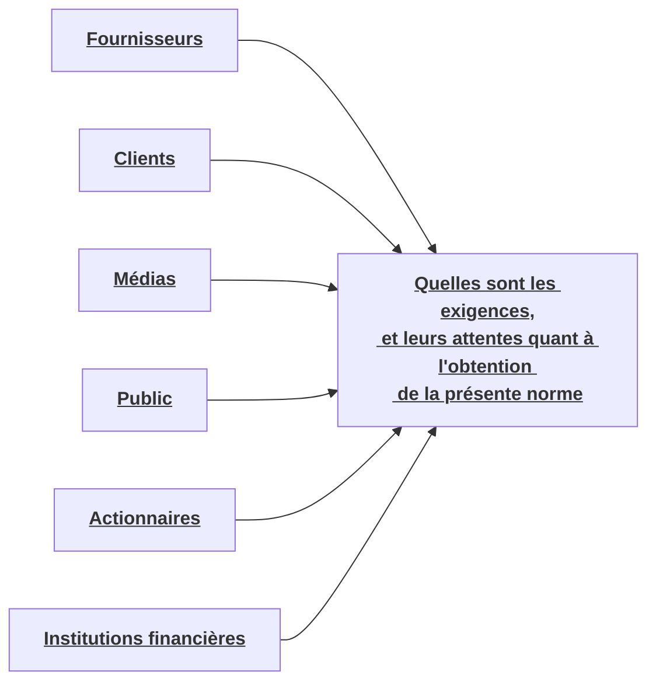

La norme ISO 27001 est la référence en matière de norme sur les systèmes de management de la sécurité de l'information.

# Définitions
**27001** et **27006** sont des **exigences**, les autres sont des guides.
ISO 27001, l'annexe A est composée des 114 mesures de sécurité de la norme ISO/CEI 27002 , classées dans 14 sections.
La certification ISO 27001 n'est pas obligatoire pour la mise en œuvre d‘un SMSI
La Norme internationale ISO/CEI 27002 est composée de 114 bonnes pratiques utilisables pour la mise en place d'un SMSI.

# 2. Normes ISO 2700X
## ISO 
L'ISO (International Standard Organisation (Organisation internationale de normalisation)) 

## ISO 27000 
Elle définit les termes et expressions utilisés dans ces normes.

## ISO 27001
fournit un cadre pour la mise en place, la mise en œuvre et la maintenance d'un système de gestion de la sécurité de l'information (SMSI). Un SMSI est un ensemble de processus et de procédures qui permettent à une organisation de protéger ses actifs informationnels contre les menaces. La norme ISO 27001 est basée sur un cycle PDCA (planifier, faire, vérifier, agir), ce qui signifie qu'il s'agit d'un processus continu d'amélioration.
La nouvelle version - BS EN ISO/|EC27001:2017 
La norme ISO/CEI 27001:2013 spécifie les exigences relatives à la mise en œuvre, le maintien en condition opérationnel, la mise à jour et l'amélioration continue d'un SMSI 

## ISO 27002 
Donne les lignes directrices relatives à la sécurité de l'information et des bonnes pratiques de management de la sécurité de l'information.

## ISO 27003 
Décrit les aspects critiques du processus de conception du SMSI 

## ISO 27004 
Fournit des éléments afin d'évaluer l'efficacité d'un SMSI.

## ISO 27005 
lignes directrices relatives à la gestion des risques en sécurité de l'information.

## ISO 27006 
fournit des lignes directrices aux organismes assurant l'audit et la certification d'un SMSI

## ISO 27007 
fournit des conseils sur la gestion d'un programme d'audit du SMSI, sur la conduite des audits et sur la compétence des auditeurs du SMSI

## ISO 19011
Lignes directrices pour l’audit des systèmes de management

## ISO 27008 
fournit des conseils sur l'examen et l'évaluation de la mise en œuvre ainsi que du fonctionnement des contrôles de sécurité de l'information.

## ISO 27017 
affine certaines mesures de sécurité de l'ISO 27002 pour lui faire tenir compte de la notion de "Cloud” 

## ISO 27035 
La Norme 27035 fournit une approche structurée et planifiée pour :
- détecter, signaler et évaluer les incidents de sécurité de l'information.
- détecter, signaler et évaluer les vulnérabilités de sécurité de l'information.
- améliorer en permanence la sécurité de l'information au travers de la gestion des incidents et des vulnérabilités.

## ISO 27037 
Lignes directrices pour l'identification, la collecte, l'acquisition et la préservation de preuves numériques.

## Norme vs Réglementation 
La **norme** est un document approuvé par un institut de normalisation, **non obligatoire**
La **réglementation** est créé par des autorités administratives: **Obligatoire**.

# Système de management
## Définitions
Le **SMSI**, est un ensemble de mesures organisationnelles et techniques permettant d'atteindre des objectifs définis.
- Les systèmes de management sont basés sur la mise en place de mécanisme d'amélioration continue, cela a automatiquement comme impact une capitalisation.
Les systèmes de management fonctionnent sur le modèle PDCA :
- Plan : Dire ce que l'on va faire.
- Do: Faire ce qu'on a dit.
- Check : Vérifier Les écarts entre le fait et Le dit.
- Act : Entreprendre les actions correctives sur les écarts. 

### Partie Prenante
Une personne, un groupe ou une organisation ayant un intérêt dans le système de gestion de la sécurité de l'information (SGSI) d'une organisation.

### Partie Intéressée
Affectée par la réalisation du système de management.

## Système de management intégré
Un système de management intégré est l'association, en terme de politique et d'objectifs, de plusieurs systèmes de management de divers domaines. 
Le système intégré le plus connu est le système **QSE, Qualité, Sécurité, Environnement**. Il existe aussi, dans certains domaines, le système QHSE où H signifie Hygiène.
Un système QSE est donc l'association de trois systèmes de management, La qualité (SMQ), la sécurité (SMSI), et l'environnement (SME).

## Maturité des processus
Les politiques sont définies et formalisées par la direction. Elles comprennent entre autres les objectifs du système de management.
Le système de management se repose donc principalement sur la qualité et la maturité de ses processus qui pourra se faire Lors d'interview avec « les process owners » ainsi que les différents intervenants du système de management et/ou de la SSI.
### Niveaux de maturité

0. **Inexistant**: *Absence totale de processus identifiables*. 
1. **Initialisé**:  *aucun processus normalisé, mais des approches tendent à être appliquées *.
2. **Reproductible**: *Des processus se sont développés*. *des personnes différentes : exécutant la même tâche utilisent des procédures similaires. Il n‘y a pas de formation formelle ou de communication des procédures et la responsabilité est laissée à l'individu*. 
3. **Défini**: *Leur utilisation est laissée à l'initiative de chacun et il est probable que des dérives soient constatées*
4. **Géré**: *Il est possible de contrôler et de mesurer la conformité aux procédures et de réagir lorsque des processus semblent ne pas fonctionner correctement.* 
 5. **Optimisé**: *Amélioration constante et comparaison avec d'autres entreprises 

# 4. Sécurité de l'information
## Introduction
**Confidentialité**, **Intégrité**, **Disponibilité**. Le principal objectif d'un SMSI est de faire en sortes que ces 3 critères soient préservés pour les biens Les plus sensibles de l'entreprise.

## Définitions
- Impact: Changement négatif réalisé au niveau des objectifs de l'activité 
- Risque: Possibilité qu'une menace donnée exploite les vulnérabilités 

![[FORMATION EXPERT SECURITE DIGITALE (ESD)/COURS/10-Intégration SMSI avec ISO 27001/img/Capture d’écran 2023-05-06 à 23.38.30.png]]

### Mesures de sécurité :
- Mesures technique
- Mesures administratives
- Mesures managériales
- Mesures juridiques
- Mesures préventives 
- Mesures de détection 
- Mesures correctives 

# 5. La norme 27001:2017
Un SMSI doit répondre aux exigences comprises entre Les chapitres 4 à 10 de la Norme.

0-1-2-3 : Généralités
4.  Contexte 
5.  Leadership 
6.  Planification
7.  Support 
8.  Fonctionnement 
9.  Evaluation des performances 
10. Amélioration

### Clause 4: Contexte de l'organisation 
#### Clause 4.1: Compréhension de l'organisme et de son contexte 
L'organisation doit déterminer les enjeux externes et internes qui influent sur les résultats attendus de son SMSI.

#### Clause 4.2 : Compréhension des besoins et des attentes des parties intéressées
Déterminer les parties prenantes ainsi que leurs attentes concernant la sécurité de l'information.

##### Les parties prenantes 

##### Ecosystème
Lois et règlements, normes, contrats signés et politiques internes
##### Compréhension de l'architecture
Matériels, logiciels, réseaux, sites

#### Clause 4.3 : Détermination du domaine d'application du SMSI 
L'organisation doit déterminer les Limites et l'applicabilité.
- des enjeux externes et internes auxquels il est fait référence en 4.1
- des exigences auxquelles il est fait référence en 4.2

#### Clause 4.4 : SMSI 
L'organisation doit établir, mettre en œuvre, tenir à jour et améliorer continuellement un SMSI
Le **choix du domaine d'application** est important.
3 types : 
- Organisationnelle:
- Systèmes d'information :
- Physique:

Analyse SWOT :
![[ESD/Documents/Images/Pasted image 20230726141938.png]]

### Clause 5: Leadership 
#### Clause 5.1 : Leadership et engagement 
Une entreprise souhaitant se conformer à La norme ISO 27001 devra donc : 
- Avoir l'engagement et l'autorisation de sa direction pour mettre en œuvre le SMSI.
- Avoir Les ressources nécessaires à sa mise en œuvre et à son maintien en condition opérationnelle.

#### Clause 5.2: Politique 
La direction doit établir une politique de sécurité de l'information
- Inclut des objectifs de sécurité de l'information 
- Inclut l'engagement de satisfaire aux exigences en matière de sécurité de l'information
- Inclut l'engagement d'œuvrer pour l'amélioration continue 
La politique de sécurité de l'information doit être disponible, communiquée, évolutive et mise à disposition
PSI -> PSSI -> Politiques de sécurité spécifiques

#### Clause 5.3: Rôles, responsabilités et autorités au sein de l'organisation:
les responsabilités et autorités des rôles sont attribuées et communiquées.

| Rôle | Responsabilités |
| ---- | --------------- |
| Responsable de la sécurité de L'information     |   Gestion de la sécurité de L'information et du SMSI              |
|  RH  |   Formation et sensibilisation. Gestion de processus RH sécurisé  | 
| Auditeur interne   | Valide la conformité du SMSI et des contrôles de sécurité   | 
|   Responsable de la gestion documentaire   |  Valide les cycles de vie des documents   |
| Responsable IT  | Gestion et implémentation des contrôles techniques? |
|  Responsable Helpdesk    | Gestion et implémentation des services (droits d'accès,...)  |
 
##### Comité exécutif :
- Membres : Direction générale, financière, humaines etc.
##### Comité de sécurité de l'information:
- Membres: DSI, responsable SMSI, RH, IT, Auditeur, Finance etc.….)
##### Comité(s) opérationnel(s):
- Membres: Dépends du comité spécifique

### Clause 6:  Planification 
#### Clause 6.1 : Actions Liées aux risques et opportunités 
##### 6.1.1 -  Généralités 
L'organisation doit tenir compte des enjeux de 4.1 et des exigences de 4.2 pour :
- S'assurer que le SMSI peut atteindre le ou les résultats escomptés
- Empêcher ou limiter Les effets indésirables.
- Appliquer une démarche d’amélioration continue.
L'organisation doit planifier :
- Les actions menées pour traiter ces risques et opportunités.
- L'évaluation de l'efficacité de ces actions.

##### Clause 6.1.2 : Appréciation des risques de sécurité de l'information 
L'organisation doit définir:
- les critères de risque 
- Identifier les risques et les propriétaires (Applique le processus d'appréciation)
- Analyser les risques (conséquences, niveaux, vraisemblance)
- Evaluer les risques (prioriser le traitement, comparer les résultats)

##### Clause 6.1.3 : Traitement des risques de sécurité de l'information 
Définir et appliquer un processus de traitement des risques:
- Choisir les options de traitement des risques appropriées
- Déterminer toutes les mesures à la mise en œuvre des options de traitement des risques 
- Comparer les mesures avec celles de l'Annexe A
- Produire une déclaration d'applicabilité contenant les mesures et leur justification 
- Elaborer un plan de traitement des risques et obtenir des propriétaires l'approbation du plan de traitement et l'acceptation des risques résiduels 

L'organisation doit répondre à toutes les mesures de l'Annexe A de la norme ISO 27001 qu'elle prend en compte et qui sont applicable à son SMSI, elle doit  **justifier les mesures non-applicables**.
Elle peut ajouter des objectifs et des mesures complémentaires.
***L'ensemble des articles de la norme (4 à 10) sont obligatoires.***
Pour la construction de la **DDA** (**Déclaration D'Applicabilité**), il faut balayer les 114 mesures de sécurité de l'Annexe A et déclarer, pour chacune d'entre elles si l'organisation s'engage a l'appliquer ou non. Attention à la définition du périmètre.

#### Mesures obligatoires par transitivité

| Mesures de sécurité de l'Annexe A | Article de la norme ISO 27001 | Thème                 |
| -------------------------- | ------------------------ | ---------------------             |
| A.5.1.1                                    | 5.2                              | Politique de sécurité               |
| A.5.1.2                                   | 8.2                              | Politique de sécurité                     |
| A.6.1.1                                    | 5.3                              |  Rôles et responsabilités                    |
| A.7.2.1                                   |  5.3                             | Responsabilités de la direction       |
| A.7.2.2                                  |  7.3                               | Sensibilisation                     |
| A.12.1.1                                  |  7.5.1                            |  Procédures d'exploitation          |
| A.12.1.2                                 |  8.1                               |    Gestion des changements        |
| A.15.1 & A.15.2                      | 8.1                                 |  Relation aves les fournisseurs          |
|A.18.1.1                                   |  4.2                               |  Identification de la législation en vigueur  |
| A.18.2.2                                 |  9.1                               |   Conformité avec les politiques en vigueur|
|  A.18.2.3                                |  9.1                               |  Vérification de la conformité technique     |
> [!TIP]
> Pour l'examen, faire attention:
> Avec un **A** devant on parle de l'**annexe de la norme**
> 

#### Clause 6.2 : Objectifs de sécurité de l'information et plans pour les atteindre 
Les objectifs de sécurité doivent être **cohérents**, **mesurables**, **communiqués**, **mis à jour** et tenir compte des exigences applicables à la sécurité de l'information.
L'organisation doit conserver des informations documentées sur les objectifs liés à la sécurité de l'information, elle doit déterminer : Quoi, avec quoi, qui, quand et comment

### Clause 7:  Support
#### Clause 7.1: Ressources
L'organisation doit identifier et fournir les **ressources nécessaires à l'établissement, la mise en œuvre, la tenue à jour** **et l'amélioration continue** du SMSI.

#### Clause 7.2: Compétences
L'organisation doit :
- Déterminer les compétences nécessaires 
- S'assurer d'une formation initiale ou continue ou d'une expérience appropriée
- Acquérir les compétences nécessaires et évaluer l'efficacité des actions entreprises 
- Conserver des informations documentées appropriées comme preuves.

#### Clause 7.3: Sensibilisation
**Formation** -> Acquisition de compétences
**Sensibilisation** -> Modification des habitudes
Les personnes effectuant un travail sous le contrôle de l'organisation doivent :
- Etre sensibilisées à la PSI.
- Avoir conscience de leur contribution à l'efficacité du SMSI
- Avoir conscience des implications de toute non-conformité aux exigences requises par le SMSI.
La sensibilisation concerne tout le personnel de l'organisation peu importe son niveau hiérarchique. 

#### Clause 7.4: Communication
Déterminer les besoins de communication interne et externe. Sur quels sujets communiquer, quand, qui, avec qui et comment ?
La gestion de la communication pendant le mode “Build” du projet SMSI tout comme en mode “Run” est nécessaire à l'atteinte des objectifs. Elle repose sur 3 piliers :
- Adéquation (disponible et pertinente, évaluée périodiquement)
- Clarté 
- Transparence (processus, méthodes et procédures disponible pour les parties intéressés)

#### Clause 7.5: Informations documentées 
##### 7.5.1: Général
Le SMSI doit inclure les informations documentées exigées par la Norme et celles qu'elle juge  nécessaires à l'efficacité du SMSI.
l'étendue des informations peut différer en fonction sa taille , ses domaines d'activité, ses processus, produits, services, la complexité des processus et la compétence des personnes.

##### 7.5.2: Création et mise à jour
Les éléments suivants sont appropriés :
- Identification et description 
- Format 
- Caractère approprié et pertinent des informations

##### 7.5.3: Maitrise des informations documentées
Doivent être contrôlées pour s'assurer qu'elles sont disponibles, adaptées et correctement protégées. 
Les exigences de la norme demande:
- Le contenu des documents : s'assurer que le contenu associé au document est bien présent dans celui-ci.
- Le format des documents : le format inclut des points comme sa date de création, sa version , son auteur les informations sur son approbation, sa dernière modification, etc.
- Son cycle de vie : La norme exige que le cycle de vie des documents soit assuré.
	1. Création
	2. Vérification
	3. Approbation
	4. Diffusion
	5. Utilisation
	6. Archivage
	7. Destruction

### Clause 8: Fonctionnement 
#### Clause 8.1: Planification et contrôle opérationnels 
Planifier, mettre en œuvre et contrôler les processus nécessaires à la réalisation des actions déterminées en 6.1. et veiller à atteindre les objectifs définis en 6.2.
L'organisation doit conserver des informations documentées, contrôler les modifications prévues, analyser les conséquences des modifications imprévues et, mener des actions pour limiter tout effet négatif.
L'organisation doit s'assurer que les processus externalisés sont définis et contrôlés.

#### Clause 8.2 :  Appréciation des risques de sécurité de l'information
L'organisation doit évaluer régulièrement les risques de sécurité de l'information et conserver des informations documentées sur les résultats de ces évaluations. (6.2)

#### Clause 8.3: Traitement des risques de sécurité de l'information 
Mise en œuvre le plan de traitement des risques et conserver des informations documentées sur les résultats
Si une appréciation des risques existe déjà, il faut vérifier sa conformité, son périmètre et son actualisation.

### Clause 9:  Evaluation des performances 
#### Clause 9.1: Surveillance, mesures, analyse et évaluation 
L'organisation doit évaluer la performance du SMSI et la sécurité de l'information. Elle détermine quoi surveiller, comment le faire, quand et par qui. Les informations documentées sont conservées en preuve.
Les indicateurs de performances (KPl) du SMSI sont liés aux objectifs, couvrant l'avancement du projet, aspects stratégiques (conformité, protection) et opérationnels (attaques, risques). Pas d'exigence spécifique, privilégier les processus critiques et éviter l'excès d'indicateurs.

##### ISO 27004
L'ISO 27004 propose des domaines de mesure tels que la mise en œuvre du SMSI, gestion d'incidents, sensibilisation, formation, contrôles d'accès, risques tiers, etc. Pour les indicateurs, il faut considérer fréquence, méthodes de calcul, restitution et l'amélioration continue.

#### Clause 9.2: Audit interne 
L'organisation doit réaliser des audits internes planifiés pour évaluer la conformité et l'efficacité du SMSI. Des programmes d'audit doivent être mis en place, en tenant compte des processus importants et des résultats précédents. Les résultats d'audit doivent être rapportés à la direction, et des preuves documentées doivent être conservées.

##### Evaluation des performances
L'audit interne d'un SMSI évalue les objectifs, la gouvernance, la gestion des risques, l'efficacité des processus, les mesures et l'amélioration continue. Il garantit la conformité et peut être complété par un audit technique. La fréquence des audits n'est pas imposée, mais un programme d'audits est nécessaire.

#### Clause 9.3: Revue de direction 
La direction doit effectuer des revues planifiées du SMSI (au moins une fois par an), évaluant son adéquation, son efficacité, les performances de sécurité, les retours d'information, les opportunités d'amélioration et les risques. Les revues doivent être documentées. Suivi des plans d'action par le responsable du SMSI et l'équipe d'audit interne.

### Clause 10:  Amélioration
#### Clause 10.1: Non-conformité et actions correctives 
En cas de non-conformité, l'organisation réagit, corrige, gère les conséquences, évalue les causes et prévient leur récurrence. Les actions correctives sont proportionnelles et documentées, incluant les résultats.

##### Amélioration
Détection et traitement des non-conformités montrent franchise et sensibilisation. L'absence de non-conformités peut susciter la méfiance. Analyser avec QQOQCP, 5 pourquoi, Ishikawa. Plans d'actions concis, corriger, échéances, résultats vérifiables, validés par la direction.

#### Clause 10.2 - Amélioration continue 
Amélioration continue du SMSI pour accroître pertinence, adéquation et efficacité. 

# 6. Implémentation ISO 27001 / SMSI
## 6.1) Définition et nature du projet
Pour implémenter l'ISO 27001, une approche de projet est essentielle, impactant toute la hiérarchie. Diviser en sous-projets peut aider. Le choix du chef de projet doit prendre en compte l'expérience pertinente (SMQ, RSSI) et une formation en ISO 27001. Communication essentielle avec direction, techniciens et utilisateurs.

## 6.2) Séquencement de l'implémentation
L'ISO 27003, rarement utilisée pour son manque de cas concret. Une approche séquentielle en suivant strictement la norme peut être risquée, négligeant la réalité du terrain, les mesures existantes, les priorités et la parallélisation des tâches.

#### La réalité du terrain :
Commencer par évaluer les pratiques de sécurité existantes pour estimer les coûts liés au périmètre sélectionné. 

#### Les mesures déjà existantes :
Il est important de considérer les mesures de sécurité existantes pour éviter des coûts inutiles.

#### La définition des priorités :
L'amélioration continue est essentielle dans le système d'information. Malgré sa place à la fin de la norme (chapitre 10), elle doit être gérée dès le début du SMSI.

#### La nécessité de paralléliser les tâches :
Pour éviter les pertes de temps, une approche "Projet" est recommandée, intégrant la norme, le modèle PDCA et la cohérence entre périmètre, politique, appréciation des risques et mesures de sécurité.

#### Approche projet phase 1 - L'analyse :
##### Etablissement d'étude d'opportunité :
Évaluation concrète du SMSI, étape stratégique nécessitant implication de la direction générale et connaissance des attentes des parties prenantes.

##### L'état des lieux :
Si l'étude d'opportunité révèle un gain potentiel pour le SMSI, faire un état des lieux des : processus, appréciation des risques, mesures de sécurité existantes, PDCA et mesures manquantes.

##### L'étude des options :
Étudier différentes options de périmètre en confrontant coûts et apports attendus du SMSI.

#### Approche projet phase 2 - Mise en œuvre de la structure :
Construire le socle du SMSI en mettant à jour la documentation, contrôlant les processus, mesurant leur efficacité et formant le personnel, même si le SMSI n'est pas achevé.

##### Gouvernance de la sécurité :
Mise en œuvre la structure de décisions au bon moment et au bon niveau

##### La documentation :
Une procédure de gestion documentaire doit exister. Elle servira de socle aux documents du SMSI.

##### Audit interne et suivi des actions :
Mettre en place l'audit interne pour assurer efficacité et conformité des processus, détectant rapidement les non-conformités.

##### La formation et la sensibilisation :
Le personnel doit être sensibilisé et compétent en sécurité. Mettre en place dès le départ un processus de gestion de la formation et de sensibilisation.

##### Les indicateurs :
Les instances de décision connaissent le niveau de conformité et les performances du SMSI, clarifiant l'avancement du projet. Les phases précédentes contribueront à la construction de nouveaux processus.

#### Approche projet phase 3 “Mise en place des processus du SMSI :
Cette phase initie l'appréciation des risques et se poursuit par la mise en place des mesures de sécurité elle est donc souvent une charge importante.

##### Appréciation des risques :
Peut être mené parallèlement à la phase précédente. L'appréciation des risques permettra de remonter les mesures de sécurité les plus appropriées.

##### Adaptation des mesures de sécurité :
Les mesures déjà en place avant le projet SMSI doivent être mises en conformité.

##### Implémentation des mesures de sécurité manquantes :
Les mesures de sécurité manquantes mais sélectionnées dans la DDA devront être implémentées.

##### La revue:
Phase “Check” du PDCA, une fois l'ensemble des phases et processus mis en place. Reste à appliquer une démarche de revue, de préparation à l'audit, d'audit à blanc ainsi que d'actions correctives et préventives.

## 6.3) Principales erreurs
Erreurs courantes dans la mise en place d'un SMSI :
- Manque d'appui de la direction
- Travailler seul
- Absence de structure de base
- Périmètre mal choisi
- Erreurs de granularité dans la DDA
- Approche "Procédures et pavé"

## 6.4) Processus de certification
Le processus de certification permet l'obtention du certificat de conformité du SMSI.
La certification est délivrée par un organisme de certification, tandis que l'accréditation est accordée par le COFRAC. L'audit sur place permet d'obtenir le certificat valable 3 ans, avec des audits de suivi annuels.

### Evaluation des performances 
Les constatations et les observations d'un audit sont appelées “Constatés d'audit” ou “Remarques d'audit ou écarts”.

Il existe 5 catégories de constats d'audit :
- Les non-conformités majeures
- Les non-conformités mineures
- Les points sensibles
- Les pistes de progrès
- Les points forts

D'après la définition de la norme ISO 9001, une non-conformité est une non-satisfaction d'une exigence.

> **NON-CONFORMITE MAJEURE (NC Maj)**
> Non-satisfaction d’une exigence du référentiel, entraînant un risque avéré de non-respect d’une exigence spécifiée mettant en cause l’efficacité ou l’amélioration du SMSI.

> **NON-CONFORMITE MINEURE (NC Min)**
> Non-satisfaction d’une exigence du référentiel n’entraînant pas de risque important de non-respect d’une exigence spécifiée ne compromettant pas l’efficacité ou l’amélioration du SMSI.

> **POINT SENSIBLE (PS)**
> Élément du SMSI sur lequel des preuves d’audit montrent que l’organisme, actuellement conforme, risque de ne plus atteindre les exigences du référentiel à court ou moyen terme.

> **PISTE DE PROGRES (PP)**
> Ou « opportunité d’amélioration ». La PP correspond à une opportunité d'amélioration, permettant soit de dépasser les exigences du référentiel, soit d'améliorer la performance du SMSI sans les dépasser..

> **POINT FORT (PF)**
> Élément du SMSI sur lequel l’organisme a soit dépassé les exigences du référentiel, soit se distingue par une pratique, méthode ou technique performante.

L'audit de certification comprend deux phases : 
- La préparation et la réalisation de l'audit sur site. La préparation implique l'examen de la documentation, la visite du site et la planification des activités d'audit. 
- La réalisation inclut des interviews, une réunion de clôture et la rédaction d'un rapport provisoire suivi du rapport définitif. Si tout est conforme, le certificat est délivré pour 3 ans.

