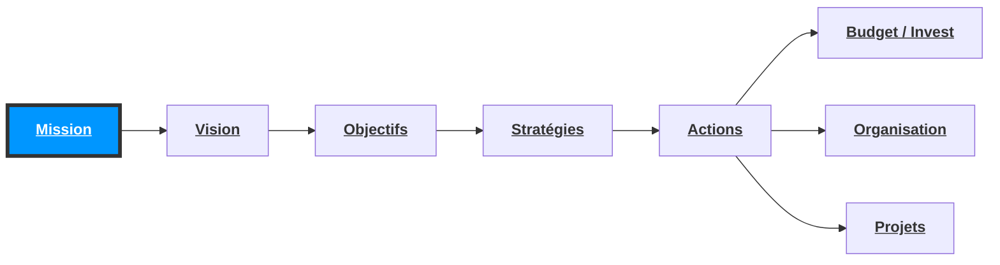

## Sommaire 

1. Cadrage et terminologie
2. PCA et entreprise
3. Etude de la norme ISO 22301
	ISO 22301 “ Contexte ”
	ISO 22301 " Leadership "
	ISO 22301 “ Planification ”
	ISO 22301 “ Support ”
	ISO 22301 “ Fonctionnement ”
	ISO 22301 " Evaluation des performances ”
	ISO 22301 " Amélioration ”
1. Retour d'expérience terrain

## 1. Cadrage et terminologie

### 1. Terminologie et Définitions

#### 1.1. PCA (Plan de continuité d'activité)
#### 1.2. PRA (Plan de reprise d'activité
#### 1.3. PCI (Plan de continuité informatique)
#### 1.4. PRI (Plan de reprise informatique)

Lors de la mise en oeuvre d'une gestion de continuité d'activité, plusieurs notions peuvent apparaître :
- **PCA** (Plan de continuité d'activité)
- **PRA** (Plan de reprise d'activité)
- **PCI** /**PRI** (Plan continuité/reprise informatique)

La distinction entre la continuité et la reprise d'activité est un élément fondamental au même titre que la distinction entre PCA/PRA et PCI/PRI.

Comme son nom l'indique les notions de continuité et de reprise d'activité sont directement liées aux activités business et non uniquement a l'informatique. Beaucoup d'entreprises et de professionnels font cet amalgame et mélange ainsi la reprise d'activité
avec la reprise informatique.

De plus, certains acteurs peuvent comprendre sauvegarde informatique lorsqu'on parle de continuité ou reprise informatique.

L'informatique est une pierre angulaire au sein des entreprises actuelles, elle permet à celle-ci l'exploitation de ses dorinées. La globalité des entreprises ayant mis en oeuvre un SI, il est alors tout a fait normal de retrouver les notions de Continuité ou reprise informatique au sein d'un PCA ou PRA.

##### PRI / PCI 
Comme vu précédemment, la notion de PCI/PRI repose donc sur la reprise ou la continuité **informatique** au sein de l'entreprise et non basée sur les activités de celle-ci :

![[ESD/Documents/Images/Pasted image 20230828092247.png]]

### 2. Continuité vs Reprise d'activité les différences 

Lorsqu'une entreprise met en place une gestion de sa continuité ou reprise d'activité plusieurs termes doivent apparaître :
- **RPO** (Recovery point objective)
- **RTO** (Recovery time objective)
- **WRT** (Work recovery time) 
- **MTD** (Maximum tolerable downtime) -> RTO + WRT 
L'ensemble de ces notions seront donc nécessaires à la compréhension du futur PCA/PRA.

![[ESD/Documents/Images/Pasted image 20230828092726.png]]

##### Pourquoi un PCA/PRA ? 
Beaucoup d'entreprises lorsqu'elles entendent PCA/PRA y voient la possibilité et capacité de restaurer leurs données en cas d'arrêt inattendu. 

L'objectif réel est la mise en oeuvre d'une structure permettant à l'entreprise de reprendre ses activités critiques dans leur ensemble.

Il peut y avoir plusieurs objectifs à la mise en oeuvre d'un PCA/PRA efficace et efficient :
- Une obligation réglementaire
- Une obligation contractuelle 
- Un alignement de continuité avec sa maison mère 
- Anticiper des événements qui pourraient impacter sa production ou ses finances.
- Avoir une réelle gestion de sa continuité d'activité
- ... 

Comme pour beaucoup de projets de type Sécurité de l'information, un problème se pose souvent lors de la mise en oeuvre de ce type de projet : Les coûts.…

En effet le retour sur investissement réel ne ce calcul pas de la même manière qu'un investissement standard, si un sinistre se produit Le PCA/PRA permettra de diminuer les pertes, mais pas de gagner à proprement parler de l'argent pour l'entreprise.

Le but ici étant d’en perdre le moins possible et pouvoir reprendre ses activités telles que prévu dans les différents plans qui seront construits.

### 3. Les erreurs courantes liés au PCA/PRA

Plusieurs erreurs apparaissent lors de la mise en oeuvre d'une PCA/PRA, il est alors intéressant de les connaître avant même le début du projet :
- La direction et/ou les services SI font souvent des amalgames concernant le ”contenu et l'étendue du projet PCA/PRA (exemple : PCI/PRI = PCA).
- Risques vis à vis des assureurs et des accords qui ont pu être signés par l'organisation.
- La non-présence d'une vraie stratégie de continuité/reprise d'activité peut engendrer des problèmes opérationnels importants.
- Non-implication de la direction dans les projets PCA/PRA, peuvent provoquer une perte de leadership et d‘engagement de la part des différents collaborateurs. 
- Le manque de mise à jour du PCA/PRA une fois le mode build terminé (exemple : mise à jour tous les 3 ans).
- La non prise en considération des obligations légales, réglementaires et contractuelles.
- Changement de type d'architectures (Interne - hybride - Cloud)
- Le BYOD
- etc ... 

## 2. PCA et entreprise

 2.1. Compréhension du positionnement d'un PCA dans une stratégie d'entreprise
 2.2. Alignement de la gestion des risques SI au PCA
 2.3. Assurance des biens tangibles/intangibles

### 2.1. Compréhension du positionnement d'un PCA dans une stratégie d'entreprise

- Mettre en place un PCA/PRA sans prendre en considération le contexte de l'entreprise revient a oublier le coeur de métier de celle-ci et donc potentiellement passer à côté d éléments essentiels vis à vis de ses attentes et objectifs en matière de continuité d'activité.
- Pour rappel, une construction de stratégie courante passe globalement par les phases suivantes: 

* Les obligations descendant de cette stratégie doivent en fonction du périmètre du PCA, être pris en considération en tant que socle d'environnement.

### 2.2. Alignement de la gestion des risques SI au PCA

- Un élément important au sein d'un PCA/PRA est le lien direct entre celui-ci et la gestion des risques SI au sein de l'entreprise.
- Sans cet alignement, comment identifiez-vous les différents scénarios probable pouvant impacter la disponibilité des biens composant votre entreprise? D'ou proviennent ces différents scénarios.
- Cette réflexion amène donc à une question/conclusion assez simple, comment un PCA/PRA peut-il être mis en oeuvre sans analyse de risques ?
- Réponse : Le PCA/PRA est incomplet et des scénarios critiques peuvent être oubliés.

> Les contrats et partenariats signés par l’organisation sont en parties à l’origine des valeurs de besoin en disponibilité requis par l’organisation.

###  2.3. Assurance des biens tangibles/intangibles

Ces dernières années, les entreprises ont évoluées dans leurs missions rendant ainsi plus complexe pour les assureurs entre autres la possibilité de quantifier les coûts d'un sinistre impactant une entreprise et ses biens.

Là ou pendant des années les biens étaient surtout tangibles et donc facilement estimable comment calculer avec exactitude les coûts de perte sur un brevet en cours et perdu, des recherches lancé depuis 2 ans, etc…

Dans le cadre de la mise en oeuvre de PCA plusieurs analyses (exemple : BIA) permettront de mettre en avant différents type d'impacts tel que les impacts financier direct et indirect. Ces valeurs pourront servir de socle afin de quantifier de manière financière les biens tangibles et intangibles de l'organisation et faciliter Les différentes démarches auprès des assureurs et investisseurs.

*Exercice 1* 
![[ESD/11-Plan de continuité (PCA) avec ISO 22301/Exercices/PCA_22301_Etude_de_cas.pdf]]

[[ESD/11-Plan de continuité (PCA) avec ISO 22301/PCA_Exercice1]]

## 3. Etude de la norme ISO 22301

3.1. PCA et l'aspect normatif
3.2. Zoom sur la norme internationale ISO 22301
3.3. Appréhender la notion de système intégré

### 3.1. PCA et l'aspect normatif

La norme **ISO 22301**:2012 exprime les **exigences** à mettre en oeuvre pour **garantir l'application** de systèmes de management de la continuité d'activité (**SMCA**)

Aucunes obligations légales n'est imposés aux organisations en France quand à l'implémentation de
PCA/PRA sauf aspects réglementaires (exemple : dans un contexte international, des établissements de
crédits et d'investissement devront se conformer à Bâle Il).

En application de l'article 32 du Règlement Général Européen pour la Protection des Données, le responsable du traitement et le sous-traitant doivent mettre en œuvre les mesures techniques et organisationnelles appropriées afin de garantir un niveau de sécurité adapté au risque des moyens permettant de garantir la confidentialité, l'intégrité, la disponibilité et la résilience constantes des systèmes et des services de traitement.

Cela inclut des mesures de prévention contre tous types de risques, même accidentels, et donc un plan de continuité d'activité pour satisfaire aux exigences de disponibilité des données. 

### 3.2. Zoom sur la norme internationale ISO 22301

* Présentation de la norme ISO 22 301
* Les différentes clauses composant Le norme
* Compréhension des avantages d'un alignement normatif :
	Avantages concurrentiels
	Besoins clients
	Alignements à la gestion de risques
	Obligations réglementaire / contractuelle
* Les interconnexions des exigences avec la norme ISO 27001

### 3.3. Appréhender la notion de système intégré

- Redéfinition de la notion de système intégré
- Mise en garde sur les différences de périmètre en cas de système intégré
- Avantages d'un système intégré

### ISO 22301 “ 4-Contexte”

1. Compréhension des besoins en sécurité de l'information de l'entreprise et de son contexte
2. Identification et recensement des besoins et attentes des parties intéressées
3. Etude des exigences légales et réglementaires applicables
4. Identification du domaine d'application du SMCA

Pour étre conforme à l'ISO 22301, un SMCA (à hauteur de son périmeétre) doit répondre aux exigences comprises entre les chapitres 4 a 10 de la norme

![[ESD/Documents/Images/Pasted image 20230828115554.png]]

![[ESD/11-Plan de continuité (PCA) avec ISO 22301/PCA_Norme_ISO_22301]]

#### 4 Contexte de l'organisation 

##### 4.1 Compréhension de l'organisation et de son contexte
L'organisation doit déterminer les enjeux externes et internes pertinents vis-à-vis de sa mission, et qui influent sur sa capacité à obtenir le(s) resultat(s) attendu(s) de son SMCA.

Ces enjeux doivent être pris en compte lors de l'établissement, de la mise en œuvre et du maintien du SMCA de l'organisation.

L'organisation doit identifier et documenter les éléments suivants :
- les activités de l'organisation, ses fonctions, ses services, ses produits, ses partenariats,les chaînes d'approvisionnement, ses relations avec les parties intéressées, et l'impact potentiel lié a un incident perturbateur
- les liens entre la politique de continuité d'activité et les objectifs de l'organisation ainsi que les autres politiques, y compris sa stratégie globale de management du risque

##### 4.2 Compréhension des besoins et attentes des parties intéressées 

###### Généralités 
Lors de l'établissement de son SMCA, l'organisation doit déterminer :
- les parties intéressées qui sont concernées par le SMCA 
- les exigences de ces parties intéressées (c'est-a-dire leurs besoins et leurs attentes, que ceux-ci soient formulés, généralement de manière implicite, ou obligatoires).

###### Exigences légales et réglementaires 
L'organisation doit établir, mettre en œuvre et tenir à jour une (des) procédure(s) lui permettant d'identifier, d'avoir accès et d'évaluer les exigences légales et réglementaires applicables auxquelles elle se soumet, en ce qui concerrie la continuité de sés opérations, produits et services, ainsi que les intérêts des parties intéressées concernées.

L'organisation doit s'assurer que les exigences légales, réglementaires ou toutes autres en vigueur auxquelles elle est soumise sont prises encompte lorsqu'elle établit, met en œuvre et tient à jour son SMCA.

L'organisation doit documenter ces informations et les tenir à jour. Toute nouveauté ou modification des exigences légales et réglementaires et des autres exigences, doit être communiquée aux employes concernés et à toutes les autres parties intéressées.

##### 4.3 Détermination du domaine d'application du système de management de la continuité d'activité 

###### Généralités 
Pour établir le domaine d'application du SMCA, l'organisation doit en déterminer les limites et l'applicabilité

Lorsqu'elle établit ce domaine d'application, l'organisation doit prendre en compte :
- les enjeux externes et internes auxquels il est fait référence en 4.1
- les exigences auxquelles il est fait référence en 4.2.
Le périmètre doit être disponible sous forme d'information documentée.

###### Domaine d'application du SMCA
L'organisation doit :
- déterminer les parties de l'organisation à inclure dans Le SMCA 
- définir les exigences relatives au SMCA, compte tenu de la mission de l'organisation, de ses buts, de ses obligations internes et externes (y compris celles liées aux parties intéressées) et de ses responsabilités légales et réglementaires
- identifier les produits, les services et toutes activités associées entrant dans le domaine d'application du SMCA 
- prendre en compte les besoins et les intérêts des parties intéressées, tels que les clients, les investisseurs, les actionnaires, la chaîne d'approvisionnement, les suggestions et besoins, les attentes et les intérêts du public et/ou de la communauté (lorsque nécessaire) 
- définir le domaine d'application du SMCA en termes et en fonction de la taille, de la nature et de la complexité de l'organisation.
- lors de la définition du domaine d'application, l'organisation doit documenter et expliquer les exclusions
- de telles exclusions ne doivent pas affecter la capacité et la responsabilité de l'organisation à assurer la continuité de l'activité et des opérations conformément d'une part aux exigences du SMCA, telles que déterminées par l'analyse des impacts sur l'activité ou l'appréciation du risque, et d'autre part aux exigences légales ou réglementaires applicables.

##### 4.4 Système de management de la continuité d'activité 

L'organisation doit établir, mettre en œuvre, tenir à jour et continuellement améliorer un SMCA, y compris les processus nécessaires et leurs interactions, conformément aux exigences de la présente Norme internationale.

*Exercice 2*
[[ESD/11-Plan de continuité (PCA) avec ISO 22301/Exercices/PCA_22301_Exercice_2.pdf]]
[[ESD/11-Plan de continuité (PCA) avec ISO 22301/Exercices/PCA_22301_Exercice_2_Correction.pdf|PCA_22301_Exercice_2_Correction]]

![[ESD/Documents/Images/Pasted image 20230829122752.png]]
### ISO 22301 " 5-Leadership"
1. Engagement de la direction
2. Etablissement d'une politique de continuité d'activité
3. Définition et affectation des rôles, responsabilités et autorisé au sein du SMCA

##### 5.1 Engagement de la direction

Les membres de la Direction et les autres managers concernés au sein de l'organisation doivent faire preuve de leadership en ce qui concerne le SMCA 

La direction doit faire preuve de leadership et affirmer son engagement en faveur du SMCA en :
- s'assurant que des politiques et des objectifs du SMCA sont établis et sont compatibles avec l'orientation stratégique de l'organisation 
- s'assurant que les exigences liées au Système de Management de la continuité d'activité sont intégrées aux processus métier de l'organisation 
- s'assurant que les ressources nécessaires pour le système de management de la continuité d'activité sont disponibles 
- communiquant sur l'importance de disposer d'un système de management de la continuité d'activité efficace et de se conformer aux exigences liées à ce système 
- s'assurant que le SMCA atteint le ou les résultats escomptés 
- orientant et soutenant les personnes pour qu'elles contribuent a l'efficacité du SMCA 
- promouvant l'amélioration continue et … 
- aidant les autres managers concernés a faire également preuve de leadership et d'engagement dès lors que cela s'applique à leurs domaines de responsabilité

La direction doit fournir des preuves de son engagement en faveur de l'établissement, de la mise en œuvre, de l'exploitation, de la surveillance, de la revue, de la tenue à jour et de l'amélioration du SMCA en :
- établissant une politique de continuité d'activité 
- s'assurant que les objectifs et les plans du SMCA sont établis 
- établissant les rôles, les responsabilités et les compétences en matière de management de la continuité d'activité ; et
- désignant une ou plusieurs personnes en tant que responsables du SMCA, ces personnes ayant l'autorité et les compétences appropriées pour assumer la responsabilité de la mise en œuvre et de la mise à jour du SMCA.

La direction doit s'assurer que les responsabilités et autorités des autres managers concernés sont attribuées et communiquées au sein de l'organisation en :

- définissant les critères d'acceptation des risques et les niveaux de risque acceptables ;
- s'engageant activement dans des exercices et des tests ;
- s'assurant que des audits internes du SMCA sont menés ;
- menant des revues de direction du SMCA ; et 
- démontrant son engagement à œuvrer pour l'amélioration continue. 

##### 5.2 Politique

La Direction doit établir une politique de continuité d'activité qui :
- est adaptée à la mission de l'organisation 
- fournit un cadre pour l'établissement d'objectifs de continuité d'activité 
- inclut l'engagement de satisfaire aux exigences applicables
- inclut l'engagement d'œuvrer pour l'amélioration continue du SMCA.

La politique du SMCA doit :
- être disponible sous forme d'information documentée 
- être communiquée au sein de l'organisation
- être mise à la disposition des parties intéressées, le cas échéant … 
- faire l'objet d'une revue, à des intervalles définis et en cas de modifications significatives, afin de s'assurer qu'elle est toujours appropriée.
L'organisation doit conserver des informations documentées sur la politique de continuité d'activité.

##### 5.3 Rôles, responsabilités et autorités au sein de l'organisation 

La Direction doit désigner qui a la responsabilité et l'autorité de :
- s'assurer que le système de management est conforme aux exigences de la présente Norme internationale ; et.
- rendre compte a la Direction des performances du SMCA.

### ISO 22301 “ 6-Planification”

1. Planification des actions face aux différents risques et opportunités
2. Définition d'objectifs de continuité d'activité associés à des plans permettant de les atteindre

##### 6.1 Actions face aux risques et opportunités 

Lorsqu'elle conçoit son SMCA, l'organisation doit tenir compte des enjeux auxquels il est fait référence
en 4.1 et des exigences de 4.2 et déterminer les risques et opportunités qui nécessitent d'être abordés pour:
- s'assurer que le système de management peut atteindre Le ou les résultats escomptés ;
- empêcher ou limiter les effets indésirables ; et 
- appliquer une démarche d'amélioration continue ;

L'organisation doit planifier :
- les actions menées du fait des risques et opportunités ;
La manière: 
- d'intégrer et de mettre en œuvre ces actions au sein des processus du SMCA (voir 81) ; et
- d'évaluer l'efficacité de ces actions (voir 9.1)

##### 6.2 Objectifs de continuité d'activité et plans pour les atteindre 

La direction doit s'assurer que les objectifs de continuité d'activité sont établis et communiqués aux fonctions et niveaux concernés au sein de l'organisation.

Les objectifs de continuité d'activité doivent :
- être cohérents avec la politique de continuité d'activité 
- tenir compte du niveau minimal de fourniture de produits et services acceptable pour que l'organisation atteigne ses objectifs
- être mesurables
- tenir compte des exigences applicables; et
- être surveillés et mis à jour quand c'est nécessaire.

L'organisation doit conserver des informations documentées sur les objectifs de continuité d'activité. Pour atteindre ses objectifs de continuité d'activité, l'organisation doit déterminer :
- qui sera responsable ;
- ce qui sera fait; 
- les ressources qui seront nécessaires ;
- les échéances et ;
- la façon dont les résultats seront évalués.

*Exercice 3*
[[ESD/11-Plan de continuité (PCA) avec ISO 22301/Exercices/PCA_22301_Exercice_3.pdf|PCA_22301_Exercice_3]]
Exemple de correction:
![[ESD/Documents/Images/Pasted image 20230829122909.png]]

[[ESD/11-Plan de continuité (PCA) avec ISO 22301/Exercices/PCA_22301_Exercice_3_Correction.pdf|PCA_22301_Exercice_3_Correction]]

### ISO 22301 “7-Support”

1. Affectation des ressources au SMCA
2. Gestion des compétences
3. Sensibilisation
4. Encadrement de la communication
5. Implémentation de cycle de vie documentaire

##### 7.1 Ressources 

L'organisation doit identifier et fournir les ressources nécessaires à l'établissement, la mise en oeuvre, la mise à jour et l'amélioration continue du SMCA.

##### 7.2 Compétences

L'organisation doit :
- déterminer Les compétences nécessaires de la ou des personnes effectuant, sous son contrôle, un travail qui a une incidence sur ses performances 
- s'assurer que ces personnes sont compétentes sur la base d'une formation initiale ou professionnelle et d'une expérience appropriées ;
- le cas échéant, mener des actions pour acquérir les compétences nécessaires et évaluer l'efficacité des actions entreprises ; 
- conserver des informations documentées appropriées comme preuves de ces compétences.

##### 7.3 Sensibilisation

Les personnes effectuant un travail sous le contrôle de l'organisation doivent :
- être sensibilisées à la politique de continuité d'activité 
- avoir conscience de leur contribution à l'efficacité du SMCA, y compris les effets positifs d'une amélioration des performances du management de la continuité d'activité ; 
- avoir conscience des implications de toute non-conformité aux exigences requises par le SMCA et
- avoir conscience de leur propre rôle durant des incidents perturbateurs.

##### 7.4 Communication

L'organisation doit déterminer les besoins de communication interne et externe pertinents pour le SMCA, et notamment :
- sur quels sujets communiquer ;
- a quels mornents communiquer ;
- avec qui communiquer.

L'organisation doit établir, mettre en œuvre et tenir à jour une ou des procédures pour :
- la communication avec les parties intéressées et les employés au sein de l'organisation 
- la communication externe avec les clients, Les entités partenaires, les collectivités locales et les autres parties intéressées, y compris les médias 
- la réception, la documentation et la réponse à une communication émanant de parties intéressées 
- la garantie d'une disponibilité des moyens de communication au cours d'un incident perturbateur 
- la facilitation d'une communication structurée avec les autorités appropriées et l'assurance de linteropérabilité des multiples organismes et personnel d'intervention, le cas échéant ; et 
- le fonctionnement et les tests des capacités de communication devant être utilisés pendant une perturbation des communications normales. 

##### 7.5 Informations documentées 

###### Généralités 

Le SMCA de l'organisation doit inclure :
- les informations documentées exigées par la présente Norme internationale ;
- les informations documentées que l'organisation juge nécessaires à l'efficacité du SMCA ;
- la taille de l'organisation, ses domaines d'activité et ses processus, produits et services ;
- la complexité des processus et de leurs interactions ;
- la compétence des personnes.

###### Création et mise à jour 

Quand elle crée et met à jour ses informations documentées, l'organisation doit s'assurer que les éléments suivants sont appropriés :
- identification et description (par exemple titre, date, auteur, numéro de référence) ;
- format (par exemple langue, version logicielle, graphiques), support (par exemple papier, électronique), et revue et validation du caractère approprié et adéquat des informations.

###### Maitrise des informations documentées

Les informations documentées exigées par le SMCA et par la présente Norme internationale doivent être maîtrisées pour s'assurer :
- qu'elles sont disponibles et propres à l'usage, où et quand elles sont nécessaires 
- qu'elles sont correctement protégées (par exemple, de toute perte de confidentialité, utilisation inappropriée ou perte d'intégrité).

Pour maîtriser Les informations documentées, l'organisation doit s'intéresser aux activités suivantes, quand elles lui sont applicables :
- distribution, accès, récupération et utilisation 
- stockage et conservation, y compris préservation de la lisibilité 
- maîtrisé des modifications (par exemple, contrôle des versions) 
- durée de conservation et suppression des informations 
- extraction et utilisation 
- préservation de la lisibilité (c'est-a-dire suffisamment claires pour être lues) ; et
- prévention de l'usage involontaire d'informations obsolètes.

Les informations documentées d‘origine externe que l'organisation juge nécessaires à la planification et au fonctionnement du SMCA doivent être identifiées comme il convient et maitrisées.

Lorsque l‘organisation met en place la maîtrise des informations documentées, elle doit s'assurer de l'existence d'une protection adéquate des informations documentées (par exemple protection contre la compromission, la modification non autorisée ou la suppression).

### ISO 22301 “8-Fonctionnement”

1. Gestion de la planification opérationnelle
2. Analyse des impacts sur l'activité
3. Appréciation des risques
4. Mise en oeuvre de stratégie de continuité d'activité
5. Etablissement de procédures de continuité d'activité
6. Exercices et tests

##### 8.1 Planification opérationnelle et maitrise 

L'organisation doit planifier, mettre en œuvre et maîtriser Les processus nécessaires à la satisfaction des exigences et à la réalisation des actions déterminées en 6.1, en :

- établissant des critères pour ces processus ; 
- mettant en œuvre la maîtrise de ces processus conformément aux critères ; et …
- conservant des informations documentées dans une mesure suffisante pour avoir l'assurance que les processus ont été suivis comme prévu.
L'organisation doit s'assurer que les processus externalisés sont maîtrisés.

 >Les critères sont ceux descendant de l’environnement de l’entreprise (exemple : obligation réglementaire) qui doit donc obligatoirement être respecté

##### 8.2 Analyse des impacts sur l'activité et appréciation du risque 

###### Généralités 

L'organisation doit établir, mettre en œuvre et tenir à jour un processus formel et documenté d'analyse des
impacts sur l'activité et d'appréciation du risque qui :
- établit le contexte de l'appréciation, définit des critères et évalue l'impact potentiel d'un incident perturbateur ;
- tient compte des exigences légales et de toutes les autres exigences auxquelles l'organisation se soumet ;
- comprend une analyse systématique, l'établissement de priorités dans les traitements du risque et leurs coûts associés ; 
- définit le résultat requis de l'analyse des impacts sur l'activité et l'appréciation du risque

###### Analyse des impacts sur l'activité

L'organisation doit définir, mettre en œuvre et tenir à jour un processus d'évaluation formel et documenté permettant de déterminer les priorités, les objectifs et les cibles de continuité d'activité et de reprise.

Ce processus doit comprendre l'évaluation des impacts d'une perturbation des activités de support à la fourniture des produits et des services de l'organisation.

L'analyse des impacts sur l'activité doit comprendre les éléments suivants :
- identification des activités de support à la fourniture de produits et à la prestation de services 
- évaluation des impacts dans le temps en cas de non réalisation de ces activités 
- détermination des délais, par ordre de priorité, de reprise de ces activités à un niveau minimal acceptable spécifié, en tenant compte de la durée au-delà de laquelle les impacts d'une absence de reprise de ces activités deviendraient être inacceptables 
- identification des dépendances et des ressources de support de ces activités, y compris les fournisseurs, les partenaires externes et les autres parties intéressées concernées.

###### Financiers directs:
Ensemble des pertes financières de l'entité résultant directement de son incapacité à traiter ses opérations à la suite d'une interruption d'activité 

###### Financiers indirects :
Perte de revenues (chiffre non réalisé) 
Perte définitive d'opportunité 

###### Image et réputation :
Préjudice porté à la crédibilité de l'entité ou de l'entreprise vis-a-vis de ses clients 

###### Juridiques et Eéglementaires : 
Conséquences de l'incapacité à remplir ses obligations réglementaires ou contractuelles … vis à vis des institutions légales ou des clients. 

![[ESD/Documents/Images/Pasted image 20230828120009.png]]

*Exercice 4* 
[[ESD/11-Plan de continuité (PCA) avec ISO 22301/Exercices/PCA_22301_Exercice_4.pdf|PCA_22301_Exercice_4]]
Exemple de correcion:
![[ESD/Documents/Images/Pasted image 20230830121443.png]]

##### EBCA (Expression en besoin de continuité d'activités)

Cette collecte est basée sur des interviews menées avec les responsables opérationnels des activités.

Les principales informations à collecter sont les suivantes :
- Les applications et les flux, triés par ordre de criticité (Office, messagerie, internet) 
- Les périodes critiques pour l'activité (date où les impacts seraient plus important) 
- Les types de solutions de secours envisageables pour l'activité (hébergeur, internet, sous-traitance etc.….) 
- Le nombre de personnes et de postes de travail 
- Le type et les spécificités du poste de travail 
- La téléphonie, les imprimantes, les fax…. 
- Les fournisseurs essentiels 
- Les documents de travails.

*Exercice 5*
[[ESD/11-Plan de continuité (PCA) avec ISO 22301/Exercices/PCA_22301_Exercice_5.pdf|PCA_22301_Exercice_5]]

Exemple Exercice 5
![[ESD/Documents/Images/Pasted image 20230830165301.png]]
![[ESD/Documents/Images/Pasted image 20230830170806.png]]

##### Appréciation du risque

L'organisation doit établir, mettre en œuvre et tenir à jour un processus formel et documenté d'appréciation du risque qui identifie, analyse et évalue de manière
systématique le risque d'incidents perturbateurs pour l'organisation.

##### L'organisation doit :

- identifier les risques de perturbation pour les activités prioritaires de l'organisation, ainsi que pour les processus, les systèmes, les informations, les personnes, les biens, les partenaires externes et les autres ressources qui les soutiennent 
- analyser le risque de manière systématique 
- évaluer les risques liés à une perturbation qui nécessitent un traitement 
- identifier les traitements proportionnés aux objectifs de continuité d'activité et à l'appétence au risque de l'organisation.

##### 8.3 Stratégie de continuité d'activité 

La détermination et le choix d'une stratégie doivent être basés sur les conclusions de l'analyse d'impact sur l'activité et de l'appréciation du risque.

L'organisation doit déterminer une stratégie de continuité d'activité appropriée pour :
- protéger les activités prioritaires 
- stabiliser, poursuivre, reprendre ou rétablir Les activités prioritaires ainsi que leurs dépendances et ressources de support 
- atténuer, répondre aux impacts et les gérer

###### Détermination et choix
- La détermination de la stratégie doit inclure l'approbation des délais de reprise des activités, par ordre de priorité.
- L'organisation doit réaliser des évaluations de la capacité de continuité d'activité des fournisseurs.

###### Établissement des exigences concernant les ressources
L'organisation doit déterminer les exigences concernant les ressources pour mettre en œuvre les stratégies choisies. Les types de ressources considérés doivent comprendre, sans toutefois s'y limiter :
- les personnes ;
- les informations et les données ;
- les bâtiments, l'environnement de travail et les utilités associées ;
- les installations, les équipements et Les consommables ;
- les systèmes de technologies de l'information et de la communication (TIC) ;
- le transport ;
- le financement ;
- les partenaires et fournisseurs. 

###### Protection et atténuation
Pour les risques identifiés nécessitant un traitement, l'organisation doit envisager des mesures proactives qui :
- réduisent la probabilité de perturbation ;
- réduisent la durée de la perturbation ;
- limitent l'impact de la perturbation sur les produits et services clés de l'organisation.

L'organisation doit choisir et mettre en œuvre des traitements du risque appropriés en fonction de son appétence au risque. 

###### Pour aller plus Loin...

La stratégie de continuité d'activité détermine l'ensemble des composants qui vont constituer le PCA.

L'élaboration de la stratégie de continuité s'appuie sur :

- L'analyse des impacts (BIA) ;
- L'expression en besoins de continuités d'activité (EBCA) ;
- La gestion des risques SI ;
- La politique de continuité d'activité ;
- La stratégie insufflée par la Direction Générale.

##### 8.4 Etablissement et mise en œuvre de procédures de continuité d'activité

L'organisation doit établir, mettre en œuvre et tenir à jour des procédures de continuité d'activité lui permettant de gérer un incident perturbateur et de poursuivre ses activités, selon les objectifs de reprise identifiés lors de l'analyse des impacts sur l'activité.

L'organisation doit documenter Les procédures (y compris les dispositions nécessaires) lui permettant d'assurer la continuité des activités et e management d'un incident perturbateur.

Les procédures doivent :
- établir un protocole de communications internes et externes approprié ;
- être précis concernant les mesures immédiates devant être prises pendant une perturbation ;
- être souples pour répondre à des menaces non prévues et à des conditions internes et externes variables ;
- se concentrer sur l'impact d'événements pouvant potentiellement perturber les opérations
- être développées sur la base d'hypothèses établies et d'une analyse des interdépendances ; et 
- être efficaces dans la réduction des conséquences par la mise en œuvre de stratégies d'atténuation appropriées

###### Structure de réponse à un incident

L'organisation doit établir, documenter et mettre en œuvre des procédures et une structure de management lui permettant de répondre à un incident perturbateur en faisant appel à un personnel ayant les responsabilités, l'autorité et les compétences nécessaires pour gérer l'incident.

La structure de réponse doit :
- identifier les seuils d'impact justifiant le déclenchement d'une réponse formelle 
- évaluer la nature et l'étendue d'un incident perturbateur ainsi que son impact potentiel, 
- activer une réponse appropriée en termes de continuité d'activité ...
- disposer de processus et de procédures pour l'activation, le fonctionnement, la coordination et la communication dé la réponse 
- disposer des ressources disponibles pour soutenir les processus et les procédures de gestion d'un incident perturbateur afin d'en réduire au minimum l'impact ; et
- communiquer avec les parties intéressées et les autorités ainsi qu'avec les médias 

En considérant la sécurité des personnes comme la première priorité et en consultation avec les parties intéressées concernées, l'organisation doit décider de communiquer ou non, en externe, sur ces risques et impacts significatifs et étayer sa décision par des
documents.

Si l'organistion décide de communiquer, elle doit alors établir et mettre en œuvre des procédures pour cette communication externe, des alertes et des avertissements auprès des médias si besoin. 

##### Avertissement et communication
L'organisation doit définir, mettre en œuvre et tenir à jour des procédures pour :
-  détecter l'incident ; …
- surveiller régulièrement l'incident ; 
- gérer la communication interne au sein de l'organisation et la réception, la documentation et la réponse à une communication émanant des parties intéressées ;
- garantir la disponibilité des moyens de communication au cours d'un incident perturbateur

L'organisation doit définir, mettre en œuvre et tenir à jour des procédures pour :
- faciliter une communication structurée avec les services d'urgence ;
- effectuer l'enregistrement des informations critiques concernant l'incident, les actions entreprises et les décisions prises, et les éléments suivants doivent également être considérés et mis en œuvre lorsque cela est approprié :

- l'alerte des parties intéressées potentiellement touchées par un incident perturbateur réel ou imminent ;
- l'assurance de l'interopérabilité des multiples services d'urgence et le personnel de l'organisation 
- le fonctignnement d'une installation de communication. Les procédures de communication et a d'avertissement doivent faire l'objet d'exercices réguliers.

##### Plans de continuité d'activité
Les plans de continuité d'activité doivent généralement contenir :
- les rôles et les responsabilités définis des personnes et des équipes ayant autorité pendant et après un incident 
- un processus d'activation de la réponse 
- les détails permettant de gérer Les conséquences immédiates d'un incident perturbateur en tenant dûment compte:

- du bien-être des individus ; 
- des options stratégiques, tactiques et opérationnelles pour répondre à la perturbation ;
- de la prévention de toute perte ou indisponibilité supplémentaire d'activités prioritaires ;

Les détails concernant la manière et les circonstances dans lesquelles l'organisation communiquera avec des employés et leurs proches, les parties intéressées clés et les personnes à contacter en cas d'urgence 

- la manière dont l'organisation poursuivra ou reprendra ses activités prioritaires dans les délais prédéterminés ;
- les détails de la réponse de l'organisation aux médias à la suite d'un incident, y compris :
	- une stratégie dé communication
	- l'interface préférée avec les médias
	- des lignes directrices ou un modèle de rédaction d'une déclaration pour les médias ; et
	- des porte-parole appropriés ;

- un processus de sortie une fois que l'incident est terminé.
Chaque plan doit définir :
- le but et le domaine d'application 
- les objectifs
- les critères et les procédures d'activation 
- les procédures de mise en œuvre 
- les rôles, les responsabilités et les autorités 
- les exigences et les procédures de communication 
- les interdépendances et interactions internes et externes 
- les exigences en termes de ressources
- les processus relatifs au flux d'information et à la documentation.

##### Reprise
L'organisation doit disposer de procédures documentées lui permettant de rétablir et de reprendre ses activités en s'appuyant sur des mesures temporaires adoptées pour répondre aux exigences métier habituelles après un incident.

##### Exercices et tests
L'organisation doit procéder à des exercices et des tests de ses procédures de continuité d'activité afin de s'assurer qu'elles sont cohérentes avec ses objectifs de continuité d'activité.

L'organisation doit mener des exercices et des tests qui :
- sont cohérents avec le périmètre et les objectifs du SMCA 
- reposent sur des scénarios appropriés qui sont bien planifiés avec des buts et des objectifs clairement définis
- cumulés au fil du temps, valident l'ensemble de ses dispositions en matière de continuité d'activité, en impliquant les parties concernées
- minimisent le risque de perturbation des opérations 
- permettent de produire, après les exercices, des rapports formalisés contenant les résultats, des recommandations et des actions pour mettre en œuvre des améliorations 
- sont revus dans le cadre d'une promotion de l'amélioration continue ; et
- sont menés a des intervalles planifiés et lorsque des changements significatifs interviennent au sein de l'organisation ou dans l'environnement dans lequel elle opère.

*Exercice 7* 
[[ESD/11-Plan de continuité (PCA) avec ISO 22301/Exercices/PCA_22301_Exercice_7.pdf|PCA_22301_Exercice_7]]

### ISO 22301 " 9-Evaluation des performances”

1. Surveillance, mesurage
2. Analyse et évaluation
3. Audit interne du SMCA
4. Mise en place de revue de direction

##### 9.1 Supervision, mesurage, analyse et évaluation

###### Généralités
L'organisation doit déterminer :
- ce qu'il est nécessaire de surveiller et mesurer
- les méthodes de supervision, de mesurage, d'analyse et d'évaluation, selon le cas, pour assurer la validité des résultats
- quand la surveillance et la mesure doivent être effectuées ; et
- quand les résultats de la surveillance et de la mesure doivent être analysés et évalués.

L'organisation doit conserver des informations documentées pertinentes comme preuves des résultats.
L'organisation doit évaluer les performances du SMCA, ainsi que l'efficacité du SMCA 

En outre, l'organisation doit :
- agir, lorsque cela est nécessaire, pour remédier aux évolutions ou résultats-négatifs avant l'apparition d'une non-conformité ;
- conserver des informations documentées appropriées comme preuves des résultats.

Les procédures de supervision des performances doivent prévoir 
- D'établir des mesures de performances adaptées aux besoins de l'organisation 
- De surveiller dans quelle mesure la politique, les objectifs et les cibles de continuité d'activité de l'organisation sont respectés/atteints ; 
- Les performances des processus, des procédures et des fonctions qui protègent ses activités prioritaires
- De surveiller la conformité à la présente Norme internationale et aux objectifs de continuité d'activité 
- De surveiller les preuves historiques de performances insuffisantes du SMCA ; et
- D'enregistrer les données et les résultats de la surveillance et des mesures pour faciliter Les actions correctives ultérieures.

##### Evaluation des procédures de continuité d'activité 

L'organisation doit mener des évaluations de ses procédures et de ses capacités en matière de continuité d'activité pour s'assurer qu'elles demeurent pertinentes, adéquates et efficaces 

Ces évaluations doivent être réalisées par le biais de revues périodiques, d'exercices, de tests, de rapports post-incident et d'évaluations des performances. Les changements significatifs intervenus doivent être pris en compte en temps opportun dans la ou les procédures. 

- L'organisation doit évaluer périodiquement la conformité aux exigences légales et réglementaires applicables, aux meilleures pratiques de son secteur ainsi que la conformité à sa propre politique de continuité d'activité et aux objectifs associés; et ,
-  l'organisation doit mener des évaluations à des intervalles planifiés et lorsque des changements significatifs interviennent.

Lorsqu'un incident perturbateur se produit et entraîne l'activation de  ses procédures de continuité d'activité, l'organisation doit procéder à une revue après l'incident et enregistrer les résultats. 

##### Audit interne 

L'organisation doit réaliser des audits internes à des intervalles planifiés afin de recueillir des informations permettant de déterminer si le système de management de la continuité d'activité.
est conforme :
- aux exigences propres de l'organisation concernant son SMCA 
- aux exigences de la présente Norme internationale 
- est efficacement mis en œuvre et tenu à jour. 

L'organisation doit :

- Planifier, établir, mettre en œuvre et tenir à jour un (des) programme(s) d'audit, couvrant notamment la fréquence, les méthodes, les responSabilités, es exigences de planification et de comptes rendus. Le(s) programme(s) d'audit doi(ven)t tenir compte de l'importance des processus concernés et des résultats des audits précédents,
- Définir les critères d'audit et le périmètre de chaque audit 
- Sélectionner des auditeurs et réaliser des audits pour assurer l'objectivité et l'impartialité du processus d'audit
- S'assurer qu'il est rendu compte des résultats des audits à la Direction concernée :et
- Conserver des informations documentées comme preuves de la mise en œuvre du programme d'audit et des résultats d'audit.

Le programme d'audit, quel que soit le moment où il est conduit, doit reposer sur les résultats des évaluations du risque des activités de l'organisation et sur les résultats des audits précédents.

Les procédures d'audit doivent englober le périmètre, la fréquence, les méthodologies et les compétences, ainsi que les responsabilités et les exigences applicables à la conduite des audits et à la rédaction d'un rapport présentant les résultats

Le management responsable du domaine audité doit assurer que toutes les corrections et actions correctives nécessaires sont entreprises sans délai indu pour éliminer les non-conformités détectées et leurs causes. 

Les actions de suivi doivent inclure la vérification des actions entreprises et le compte-rendu des résultats de cette vérification.

##### Revue de direction

À des intervalles planifiés, La Direction doit procéder à La révision du SMCA de l'organisation, afin de s'assurer qu'il est toujours approprié, adapté et efficace.

La revue de Direction doit prendre en compte :
- L'état d'avancement des actions décidées lors des revues de direction précédentes ;
- Les modifications des enjeux externes et internes pertinents pour le système de management de la continuité d'activité ;
- les informations sur Les performances en matière de continuité d'activité, y compris les tendances concernant :
	- les non-conformités et Les actions correctives 
	- les résultats de l'évaluation de la supervision et du mesurage ; et
	- Les résultats des audits 
- les axes d'amélioration continue. 

Les revues de direction doivent prendre en compte les performances de l'organisation, y compris :
- Le suivi des actions décidées lors des revues de direction précédentes ;
- la nécessité d'apporter des modifications au SMCA, y compris la politique et les objectifs ;
- les axes d'amélioration ;
- Les résultats des audits et des révisions du SMCA, y compris ceux des fournisseurs et partenaires clés le cas échéant 
- Les techniques, les produits ou les procédures, qui pourraient être utilisés dans l'organisation pour améliorer les performances et l'efficacité du SMCA 
- L'état d'avancement des actions correctives 
- Les résultats des exercices et des tests
- Les risques ou les questions qui n'ont pas été traités de manière appropriée lors d'une précédente évaluation des risques
- Tous les changements pouvant affecter le SMCA, qu'ils soient internes ou externes au périmètre du SMCA 
- L'adéquation de la politique 
- Les recommandations d'amélioration 
- Les leçons tirées et les actions découlant d'incidents pertufbateurs ; et
- Les bonnes pratiques et lignes directrices qui apparaissent.

Les conclusions de la revue de direction doivent inclure les décisions relatives aux axes d'amélioration continue et aux éventuels changements nécessaires à apporter au SMCA, et comprendre les éléments suivants :
- les variations apportées au périmètre du SMCA 
- l'amélioration de l'efficacité du SMCA 
- la mise à jour de l'évaluation des risques, du bilan d'impact sur les activités, des plans de continuité d'activité et des procédures associées 
- la modification des procédures et des contrôles pour répondre à des événements,internes ou externes qui peuvent influer sur le SMCA, y compris les changements apportés aux : 
1) exigences métier et opérationnelles 
2) exigences de réduction des risques et de sécurité
3) conditions et processus opérationnels 
4) exigences légales et réglementaires 
5) obligations contractuelles 
6) niveaux de risque et/ou critères d'acceptation des risques
7) besoins en termes de ressources 
8) exigences en matière de financement et de budget

la manière dont l'efficacité des contrôles est mesurée.

L'organisation doit conserver des informations documentées attestant des conclusions des revues de direction.

L'organisation doit :
- Communiquer les conclusions de la revue de direction aux parties intéressées concernées ; et … 
- Entreprendre l'action appropriée en relation avec ces conclusions. ...

### ISO 22301 "10-Amélioration”

1. Etudes des non-conformités
2. Actions correctives
3. Amélioration continue

##### 10.1 Non conformité et actions correctives 

Lorsqu'une non-conformité se produit, l'organisation doit
- identifier la non-conformité 
- réagir à la non-conformité, et le cas échéant : 
	- agir pour la maîtriser et la corriger
	- faire face aux conséquences 

Evaluer s'il est nécessaire de mener une action pour éliminer les causes de la non-conformité, de sorte qu'elles ne se reproduisent pas, au même endroit ou ailleurs, en :
- révisant la non-conformité 
- déterminant les causes de la non-conformité ;
- déterminant si des non-conformités similaires existent, ou pourraient potentiellement se produire 
- évaluant le besoin d'entreprendre des actions correctives pour s'assurer que les non-conformités ne se reproduisent pas, au même endroit ou ailleurs 
- déterminant et mettant en œuvre les actions correctives nécessaires ;
- révisant l'efficacité de toute action corrective mise en œuvre ;
- modifiant, si nécessaire, le SMCA

Lorsqu'une non-conformité se produit, l'organisation doit
- mettre en œuvre toutes les actions nécessaires ;
- réviser l'efficacité de toute action corrective mise en œuvre ;
- modifier, si nécessaire, Le système de management de la continuité d'activité. 

Les actions correctives doivent être à la mesure des effets des non-conformités rencontrées. 
L'organisation doit conserver des informations documentées comme preuves :
- de la nature des non-conformités et de toute action subséquente ;
- des résultats de toute action corrective.

##### 10.2 Amélioration continue 

L'organisation doit continuellement améliorer la pertinence, l'adéquation et l'efficacité du SMCA. 
*Exercice 9*
[[FORMATION EXPERT SECURITE DIGITALE (ESD)/Exo]]
## 4. Retour d'expérience terrain
![[ESD/Documents/Images/Pasted image 20230901162425.png]]

# Divers
https://openclassrooms.com/fr/courses/6227526-mettez-en-place-un-plan-de-continuite-dactivite-pca/6674416-definissez-la-continuite-dactivite
https://www.clubpca.eu/

- La continuité d’activité a pour vocation de **réduire** une situation de **crise en situation d'urgence**.  
- Elle ne s’intéresse qu’aux événements perturbateurs **non maîtrisables** dans un délai défini comme **grave**.
- Le **plan de continuité d'activité** est l'ensemble des mesures qui permettent de sortir d'une situation d'urgence pour rétablir l'activité au plus vite, souvent en mode dégradé.
## la norme ISO 22301
_**système de management de la continuité d’activité, ou SMCA**._
**ISO** **22301** est une norme qui spécifie les exigences pour **planifier,** **établir,** **mettre en œuvre, exploiter, surveiller, revoir, maintenir et améliorer en continu** un système de management de la continuité d’activité.

![[ESD/Documents/Images/15916254178999_Chapitre 1.3 Schema chapitre 1.4 SMCA_2.jpg]]

- Pour mettre en place un système de management de la continuité d’activité (SMCA), appuyez-vous sur la norme certifiante **ISO 22301**. 
- La norme certifiante ISO 22301 et d’autres normes afférentes vous assurent de bénéficier des **meilleures conditions de réussite** de la mise en place de votre SMCA.
- La certification d’une partie des activités de votre entreprise est une démarche **progressive** qui vous assure une **reconnaissance** de vos clients, fournisseurs, et des régulateurs.

-  Le **soutien** de votre Direction générale est essentiel pour entreprendre un SMCA. 
- Grâce à la **note d'intention**, votre Direction pourra démontrer sa volonté d'action, la personne responsable et les ressources allouées, et prévenir l'ensemble des parties prenantes. 
- C'est ensuite à vous d'être **diplomate** et **bon communicant** pour intégrer ces parties prenantes : leur implication est cruciale pour la réussite de votre projet.
- La **sensibilisation** a pour objet d'attirer l'attention et de faire évoluer les habitudes. La sensibilisation est destinée à toucher les **émotions** et les **comportements**.
- La **formation** est destinée à acquérir des compétences, c’est-à-dire des aptitudes à mettre en pratique du savoir, du savoir-faire et du savoir-être.
- Un **vocabulaire commun** et une **réunion de lancement** avec le sponsor du projet vont vous aider à partir du bon pied.   
- **Formation** et **sensibilisation** sont les deux éléments clés pour vous assurer que votre PCA soit appliqué efficacement. 
- Soyez **rigoureux** dans vos plans de formation et de sensibilisation, pour vous assurer que les parties prenantes soient bien **formées** et **aptes** à agir lors d'un sinistre.

**bilan d’impact sur l’activité ou _BIA_ (ou en anglais, _Business Impact Analysis_)**
Pour chaque activité, le BIA évalue trois paramètres :
- le **délai maximal d’interruption admissible (DMIA)**. Par exemple 4 heures, 24 heures, etc. Le DMIA classe les **activités par priorité** de reprise d’activité ; 
- la **PMDT,** **c’est-à-dire la perte maximale de données tolérable**. Par exemple, aucune perte de données, 24 heures de perte de données, etc. Cela dépend de la dernière prise de **sauvegarde de recours** externalisée nécessaire à la reprise d’activité ;
- l’**OMCA,** **c’est-à-dire l’objectif minimal de continuité d’activité**. Par exemple, l’activité peut travailler avec la moitié de l’effectif nominal à la fin du DMIA qui marque le début de la reprise d’activité de l’activité.

- Pour effectuer un BIA, vous devez garder en tête les questions suivantes :
    - Quelles sont vos activités critiques ?
    - Quelles sont leurs durées d’interruption maximales ?
    - Quels sont les niveaux de dégradation de service acceptables ?
    - Quels sont les ressources/moyens nécessaires pour fonctionner, dont les parties intéressées ? 

- À la fin de ce BIA, vous disposez de plusieurs éléments :
    - la **liste** **de vos activités prioritaires** à redémarrer en cas d’arrêt, validée par la Direction générale ;
    - l’**explicitation** et la **justification** des **besoins** de continuité d’activité (contractuelles, réglementaires, d'image, etc.) ;
    - l’indication des **ressources minimales** nécessaires pour satisfaire aux exigences de continuité d’activité ;
    - la liste des **activités** liées et des parties intéressées.